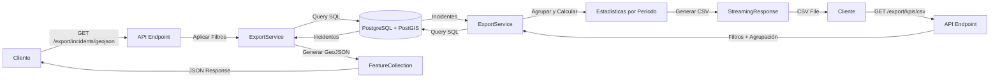

# B-09: Exportaciones CSV/GeoJSON de Incidentes y KPIs

## 📋 Resumen

Módulo de exportación de datos que permite exportar:
- **Incidentes con ubicación geográfica** en formato **GeoJSON** (para visualización en mapas y análisis GIS)
- **Listado detallado de incidentes** en formato **CSV** (para análisis en Excel/Sheets)
- **Métricas agregadas (KPIs)** en formato **CSV** (para reportes ejecutivos y dashboards)

**Implementación**: Diciembre 2024  
**Estado**: ✅ Completado  

---

## 🎯 Objetivos

1. **Interoperabilidad con herramientas GIS**: Exportar incidentes en formato GeoJSON compatible con QGIS, ArcGIS, Leaflet, Mapbox, Google Maps
2. **Análisis de datos**: Proporcionar CSV para análisis en hojas de cálculo
3. **Reportes ejecutivos**: Generar KPIs agregados por período temporal
4. **Filtrado flexible**: Soportar múltiples criterios de filtrado (fechas, ubicación, estado, prioridad)
5. **Rendimiento**: Exportaciones rápidas con límites razonables (máx. 10,000 registros)

---

## 🏗️ Arquitectura

### Componentes

```
backend/
├── services/
│   └── export_service.py         # Lógica de generación GeoJSON/CSV
├── schemas/
│   └── export.py                  # Schemas de filtros y respuestas
└── api/routes/
    └── export.py                  # Endpoints REST
```

### Flujo de Exportación



---

## 📡 Endpoints API

### 1. Exportar Incidentes en GeoJSON

```http
GET /api/v1/export/incidents/geojson
Authorization: Bearer {token}
```

**Caso de uso**: Visualización en mapas, análisis GIS

**Filtros** (todos opcionales):
- `status` (list): Estados (ej: `open`, `assigned`, `in_progress`)
- `priority` (list): Prioridades (ej: `alta`, `critica`)
- `damage_type` (string): Tipo de daño (`bache`, `grieta`)
- `severity` (string): Severidad (`baja`, `media`, `alta`)
- `city` (string): Ciudad (búsqueda parcial, case-insensitive)
- `province` (string): Provincia
- `date_from` (datetime): Fecha inicio (ISO 8601)
- `date_to` (datetime): Fecha fin (ISO 8601)
- `include_closed` (bool): Incluir cerrados (default: `false`)

**Respuesta**: GeoJSON FeatureCollection

```json
{
  "type": "FeatureCollection",
  "metadata": {
    "generated_at": "2024-12-15T10:30:00",
    "total_features": 150,
    "filters_applied": {
      "city": "Santo Domingo",
      "priority": ["alta", "critica"],
      "date_from": "2024-01-01T00:00:00",
      "date_to": "2024-12-31T23:59:59"
    }
  },
  "features": [
    {
      "type": "Feature",
      "geometry": {
        "type": "Point",
        "coordinates": [-69.9312, 18.4861]
      },
      "properties": {
        "id": 1,
        "report_id": 42,
        "damage_type": "bache",
        "severity": "alta",
        "priority": "critica",
        "priority_score": 85.5,
        "status": "assigned",
        "address": "Av. Winston Churchill #1234",
        "city": "Santo Domingo",
        "province": "Distrito Nacional",
        "latitude": 18.4861,
        "longitude": -69.9312,
        "reported_by_id": 15,
        "reported_by_name": "usuario123",
        "is_verified": false,
        "created_at": "2024-12-10T08:30:00",
        "assigned_at": "2024-12-10T09:00:00",
        "resolution_time_hours": null,
        "estimated_repair_hours": 4.0
      }
    }
  ]
}
```

**Ejemplo de uso (curl)**:

```bash
# Exportar incidentes críticos en Santo Domingo (último mes)
curl -X GET "http://localhost:8000/api/v1/export/incidents/geojson?priority=critica&city=Santo%20Domingo&date_from=2024-11-15T00:00:00&date_to=2024-12-15T23:59:59" \
  -H "Authorization: Bearer YOUR_JWT_TOKEN" \
  -o incidentes_criticos.geojson

# Exportar todos los incidentes activos (sin cerrados)
curl -X GET "http://localhost:8000/api/v1/export/incidents/geojson?include_closed=false" \
  -H "Authorization: Bearer YOUR_JWT_TOKEN" \
  -o incidentes_activos.geojson

```

---

### 2. Exportar Incidentes Detallados en CSV

```http
GET /api/v1/export/incidents/csv
Authorization: Bearer {token}
```

**Caso de uso**: Análisis en Excel/Google Sheets, reportes tabulares

**Filtros**: Idénticos al endpoint GeoJSON

**Respuesta**: Archivo CSV con las siguientes columnas:

| Columna | Descripción |
|---------|-------------|
| `id` | ID del incidente |
| `report_id` | ID del reporte original |
| `status` | Estado actual |
| `priority` | Nivel de prioridad |
| `priority_score` | Score numérico (0-100) |
| `damage_type` | Tipo de daño |
| `severity` | Nivel de severidad |
| `latitude` | Latitud (WGS84) |
| `longitude` | Longitud (WGS84) |
| `address` | Dirección |
| `city` | Ciudad |
| `province` | Provincia |
| `reported_by_name` | Usuario reportante |
| `is_verified` | Verificado (bool) |
| `verified_by_name` | Usuario verificador |
| `created_at` | Fecha creación (ISO 8601) |
| `assigned_at` | Fecha asignación |
| `started_at` | Fecha inicio trabajo |
| `completed_at` | Fecha completado |
| `verified_at` | Fecha verificación |
| `resolution_time_hours` | Tiempo de resolución (horas) |
| `estimated_repair_hours` | Estimado de reparación |

**Ejemplo de contenido**:

```csv
id,report_id,status,priority,priority_score,damage_type,severity,latitude,longitude,address,city,province,reported_by_name,is_verified,verified_by_name,created_at,assigned_at,started_at,completed_at,verified_at,resolution_time_hours,estimated_repair_hours
1,42,assigned,critica,85.5,bache,alta,18.4861,-69.9312,Av. Winston Churchill #1234,Santo Domingo,Distrito Nacional,usuario123,False,,2024-12-10T08:30:00,2024-12-10T09:00:00,,,,,4.0
2,43,completed,alta,72.3,grieta,media,18.4705,-69.9380,Calle El Conde #567,Santo Domingo,Distrito Nacional,ciudadano456,True,supervisor1,2024-12-09T14:20:00,2024-12-09T15:00:00,2024-12-09T16:00:00,2024-12-10T10:30:00,2024-12-10T11:00:00,19.17,6.0
```

**Ejemplo de uso (curl)**:

```bash
# Exportar incidentes completados en el último mes
curl -X GET "http://localhost:8000/api/v1/export/incidents/csv?status=resolved&status=verified&status=closed&date_from=2024-11-01T00:00:00" \
  -H "Authorization: Bearer YOUR_JWT_TOKEN" \
  -o incidentes_completados.csv

# Exportar todos los baches de alta severidad
curl -X GET "http://localhost:8000/api/v1/export/incidents/csv?damage_type=bache&severity=alta" \
  -H "Authorization: Bearer YOUR_JWT_TOKEN" \
  -o baches_alta_severidad.csv
```

---

### 3. Exportar KPIs Agregados en CSV

```http
GET /api/v1/export/kpis/csv
Authorization: Bearer {token}
```

**Caso de uso**: Reportes ejecutivos, análisis de tendencias, dashboards

**Parámetros obligatorios**:
- `date_from` (datetime): Fecha inicio
- `date_to` (datetime): Fecha fin (máximo 2 años de rango)

**Parámetros opcionales**:
- `group_by` (enum): Nivel de agregación
  - `day`: Diario (default)
  - `week`: Semanal (formato ISO: YYYY-W##)
  - `month`: Mensual (YYYY-MM)
- `city` (string): Filtrar por ciudad
- `province` (string): Filtrar por provincia

**Respuesta**: CSV con métricas agregadas por período

**Columnas**:

| Columna | Descripción |
|---------|-------------|
| `periodo` | Período temporal (según `group_by`) |
| `total_incidentes` | Total de incidentes en el período |
| `nuevos` | Estado: OPEN |
| `asignados` | Estado: ASSIGNED |
| `en_proceso` | Estado: IN_PROGRESS |
| `resueltos` | Estado: RESOLVED |
| `verificados` | Estado: VERIFIED |
| `cerrados` | Estado: CLOSED |
| `prioridad_critica` | Prioridad CRITICA |
| `prioridad_alta` | Prioridad ALTA |
| `prioridad_media` | Prioridad MEDIA |
| `prioridad_baja` | Prioridad BAJA |
| `baches` | Tipo: BACHE |
| `grietas` | Tipo: GRIETA |
| `severidad_alta` | Severidad ALTA |
| `severidad_media` | Severidad MEDIA |
| `severidad_baja` | Severidad BAJA |
| `tiempo_resolucion_promedio_horas` | Promedio de horas para completar |
| `tasa_verificacion_porcentaje` | % de incidentes verificados |
| `porcentaje_resueltos` | % de incidentes resueltos |

**IMPORTANTE**: El CSV incluye una fila de TOTALES al final

**Ejemplo de contenido (agrupación mensual)**:

```csv
periodo,total_incidentes,nuevos,asignados,en_proceso,resueltos,verificados,cerrados,prioridad_critica,prioridad_alta,prioridad_media,prioridad_baja,baches,grietas,severidad_alta,severidad_media,severidad_baja,tiempo_resolucion_promedio_horas,tasa_verificacion_porcentaje,porcentaje_resueltos
2024-01,45,5,10,12,8,6,4,12,18,10,5,30,15,20,18,7,24.5,13.33,40.0
2024-02,52,8,12,15,9,5,3,15,20,12,5,35,17,25,20,7,28.3,9.62,32.69
2024-03,48,6,11,10,10,7,4,10,22,11,5,32,16,22,19,7,22.1,14.58,43.75

TOTALES
TOTAL,145,19,33,37,27,18,11,37,60,33,15,97,48,67,57,21,24.97,12.41,38.62
```

**Ejemplo de uso (curl)**:

```bash
# KPIs mensuales del año 2024
curl -X GET "http://localhost:8000/api/v1/export/kpis/csv?date_from=2024-01-01T00:00:00&date_to=2024-12-31T23:59:59&group_by=month" \
  -H "Authorization: Bearer YOUR_JWT_TOKEN" \
  -o kpis_2024_mensual.csv

# KPIs semanales de Santo Domingo (último trimestre)
curl -X GET "http://localhost:8000/api/v1/export/kpis/csv?date_from=2024-10-01T00:00:00&date_to=2024-12-31T23:59:59&group_by=week&city=Santo%20Domingo" \
  -H "Authorization: Bearer YOUR_JWT_TOKEN" \
  -o kpis_sdo_semanal_q4.csv

# KPIs diarios del último mes
curl -X GET "http://localhost:8000/api/v1/export/kpis/csv?date_from=2024-11-15T00:00:00&date_to=2024-12-15T23:59:59&group_by=day" \
  -H "Authorization: Bearer YOUR_JWT_TOKEN" \
  -o kpis_diarios_30dias.csv
```

---

### 4. Estado del Servicio

```http
GET /api/v1/export/status
Authorization: Bearer {token}
```

**Respuesta**:

```json
{
  "service": "export",
  "available_formats": ["geojson", "csv"],
  "endpoints": {
    "incidents_geojson": "/api/v1/export/incidents/geojson",
    "incidents_csv": "/api/v1/export/incidents/csv",
    "kpis_csv": "/api/v1/export/kpis/csv",
    "status": "/api/v1/export/status"
  },
  "limits": {
    "max_date_range_days": 730,
    "max_records_per_export": 10000,
    "supported_grouping": ["day", "week", "month"],
    "geojson_max_features": 10000,
    "csv_max_rows": 10000
  }
}
```

---

## 🔧 Implementación

### ExportService

**Ubicación**: `backend/services/export_service.py`

**Métodos principales**:

```python
class ExportService:
    def export_incidents_geojson(
        self,
        status: Optional[List[str]] = None,
        priority: Optional[List[str]] = None,
        # ... otros filtros
    ) -> Dict[str, Any]:
        """Generar GeoJSON FeatureCollection"""
        # 1. Construir query con filtros
        # 2. Ejecutar query
        # 3. Extraer coordenadas con ST_X, ST_Y
        # 4. Obtener datos relacionados (usuarios)
        # 5. Construir features GeoJSON
        # 6. Retornar FeatureCollection con metadata
    
    def export_incidents_detailed_csv(self, ...) -> str:
        """Generar CSV tabular de incidentes"""
        # 1. Aplicar filtros (igual que GeoJSON)
        # 2. Escribir headers CSV
        # 3. Iterar incidentes y escribir filas
        # 4. Retornar string CSV
    
    def export_kpis_csv(
        self,
        date_from: datetime,
        date_to: datetime,
        group_by: str = "day",
        city: Optional[str] = None,
        province: Optional[str] = None
    ) -> str:
        """Generar CSV de KPIs agregados"""
        # 1. Filtrar incidentes por fecha y ubicación
        # 2. Agrupar por período (_group_incidents_by_period)
        # 3. Calcular estadísticas por grupo
        # 4. Escribir CSV con filas por período
        # 5. Agregar fila de totales
        # 6. Retornar string CSV
    
    def _group_incidents_by_period(
        self,
        incidents: List[Incident],
        group_by: str
    ) -> Dict[str, Dict[str, Any]]:
        """Agrupar incidentes y calcular stats"""
        # - Por día: strftime("%Y-%m-%d")
        # - Por semana: strftime("%Y-W%V") (ISO week)
        # - Por mes: strftime("%Y-%m")
        # Calcular contadores por estado, prioridad, tipo, severidad
        # Calcular tiempo promedio de resolución
        # Calcular tasas (verificación, resolución)
```

**Dependencias PostGIS**:
- `ST_X(location)`: Extraer longitud
- `ST_Y(location)`: Extraer latitud
- Ambas funciones devuelven coordenadas en el SRID original (4326 = WGS84)

**Optimizaciones**:
- Query única por exportación (no N+1 queries)
- Lazy loading de relaciones (users)
- String concatenation para CSV (sin archivos temporales)
- Límite de 10,000 registros para evitar timeouts

---

## 📊 Casos de Uso

### 1. Visualización en Mapa Web (Leaflet)

**Objetivo**: Mostrar todos los incidentes activos en un mapa interactivo

**Código JavaScript**:

```javascript
// Obtener GeoJSON del backend
const response = await fetch(
  'http://localhost:8000/api/v1/export/incidents/geojson?include_closed=false',
  {
    headers: {
      'Authorization': `Bearer ${token}`
    }
  }
);

const geojson = await response.json();

// Cargar en Leaflet
const map = L.map('map').setView([18.4861, -69.9312], 11);
L.tileLayer('https://{s}.tile.openstreetmap.org/{z}/{x}/{y}.png').addTo(map);

// Agregar capa GeoJSON
L.geoJSON(geojson, {
  pointToLayer: function (feature, latlng) {
    // Colorear según prioridad
    const color = {
      'critica': 'red',
      'alta': 'orange',
      'media': 'yellow',
      'baja': 'green'
    }[feature.properties.priority];
    
    return L.circleMarker(latlng, {
      radius: 8,
      fillColor: color,
      color: '#000',
      weight: 1,
      opacity: 1,
      fillOpacity: 0.8
    });
  },
  onEachFeature: function (feature, layer) {
    // Popup con info
    layer.bindPopup(`
      <b>Incidente #${feature.properties.id}</b><br>
      Tipo: ${feature.properties.damage_type}<br>
      Prioridad: ${feature.properties.priority}<br>
      Estado: ${feature.properties.status}<br>
      Dirección: ${feature.properties.address}
    `);
  }
}).addTo(map);
```

---

### 2. Análisis en Excel (Power Query)

**Objetivo**: Analizar tiempos de resolución

**Pasos**:

1. Exportar CSV desde API:
   ```bash
   curl -X GET "http://localhost:8000/api/v1/export/incidents/csv?status=resolved&status=verified&status=closed" \
     -H "Authorization: Bearer TOKEN" \
     -o incidentes_completados.csv
   ```

2. Importar en Excel:
   - **Datos** → **Desde archivo de texto/CSV**
   - Seleccionar `incidentes_completados.csv`
   - Configurar delimitador: coma
   - Tipo de datos: Automático

3. Análisis con Tabla Dinámica:
   - **Filas**: `city`
   - **Valores**: Promedio de `resolution_time_hours`
   - **Filtros**: `is_verified = True`

4. Crear gráfico de barras comparativo

---

### 3. Reporte Ejecutivo Mensual

**Objetivo**: Generar reporte mensual para gerencia con tendencias y KPIs

**Pasos**:

1. Exportar KPIs mensuales:
   ```bash
   curl -X GET "http://localhost:8000/api/v1/export/kpis/csv?date_from=2024-01-01T00:00:00&date_to=2024-12-31T23:59:59&group_by=month" \
     -H "Authorization: Bearer TOKEN" \
     -o kpis_2024.csv
   ```

2. Importar en Google Sheets

3. Crear métricas derivadas:
   - **Tasa de cierre mensual**: `cerrados / total_incidentes`
   - **Backlog**: `nuevos + asignados + en_proceso`
   - **Eficiencia**: `resueltos / (resueltos + en_proceso)`

4. Visualizar con Google Data Studio:
   - Línea de tiempo: total de incidentes por mes
   - Gráfico de áreas: distribución por estado
   - Gauge: tasa de verificación promedio
   - Tabla: métricas clave (última fila de totales)

---

### 4. Análisis GIS en QGIS

**Objetivo**: Identificar zonas con alta concentración de incidentes no resueltos

**Pasos**:

1. Exportar GeoJSON:
   ```bash
   curl -X GET "http://localhost:8000/api/v1/export/incidents/geojson?status=open&status=assigned&status=in_progress" \
     -H "Authorization: Bearer TOKEN" \
     -o incidentes_activos.geojson
   ```

2. Importar en QGIS:
   - **Capa** → **Añadir capa** → **Vector**
   - Seleccionar `incidentes_activos.geojson`
   - CRS: EPSG:4326 (WGS84)

3. Análisis de densidad:
   - **Vector** → **Herramientas de análisis** → **Mapa de calor**
   - Radio: 500 metros
   - Campo de ponderación: `priority_score`

4. Identificar hotspots:
   - Áreas rojas: alta concentración de incidentes prioritarios
   - Exportar polígonos de hotspots
   - Sugerir asignación de recursos a esas zonas

---

## 🔒 Seguridad y Permisos

### Autenticación

**Todos los endpoints requieren JWT válido**:
- Header: `Authorization: Bearer {token}`
- Dependencia FastAPI: `get_current_active_user`

**Roles permitidos**:
- `ADMIN`: Acceso completo a todas las exportaciones
- `SUPERVISOR`: Acceso a exportaciones de su jurisdicción (ciudad/provincia)
- `CIUDADANO`: Sin acceso (endpoints no públicos)

### Validaciones

1. **Límite de registros**: Máximo 10,000 incidentes por exportación
   - Si se excede: HTTP 400 con mensaje de error
   - Solución: Usar filtros más restrictivos

2. **Rango de fechas**: Máximo 2 años para KPIs
   - Previene consultas excesivamente pesadas
   - Si se excede: HTTP 400

3. **Validación de filtros**:
   - `date_to >= date_from`
   - Enums válidos (status, priority, damage_type, severity)

### Rate Limiting (futuro)

**Recomendación**: Implementar rate limiting para exportaciones:
- 10 exportaciones por usuario por hora
- 100 exportaciones por IP por día
- Usar middleware de FastAPI o nginx

---

## 📈 Métricas y Monitoreo

### Logs

**Registrar en cada exportación**:
- Usuario que exporta
- Tipo de exportación (geojson, csv_incidents, csv_kpis)
- Filtros aplicados
- Cantidad de registros exportados
- Tiempo de generación (ms)
- Tamaño del archivo (bytes)

**Ejemplo de log**:
```
2024-12-15 10:30:45 INFO user_id=42 export_type=geojson filters={"city":"Santo Domingo","priority":["alta","critica"]} records=150 time_ms=324 size_bytes=45823
```

### KPIs del Servicio

**Métricas a monitorear**:
- Exportaciones por tipo (geojson, csv_incidents, csv_kpis)
- Tiempo promedio de generación por tipo
- Usuarios más activos
- Filtros más utilizados
- Errores (límite excedido, timeouts)

**Dashboard sugerido (Grafana)**:
- Gráfico de líneas: Exportaciones por día
- Tabla: Top 10 usuarios exportadores
- Pie chart: Distribución por tipo de exportación
- Histogram: Distribución de tiempos de respuesta

---

## 🧪 Pruebas

### Casos de Prueba Unitarios

**test_export_service.py**:

```python
def test_export_geojson_structure():
    """Verificar estructura GeoJSON válida"""
    geojson = export_service.export_incidents_geojson()
    assert geojson["type"] == "FeatureCollection"
    assert "metadata" in geojson
    assert "features" in geojson
    assert isinstance(geojson["features"], list)

def test_export_geojson_feature_properties():
    """Verificar propiedades de feature"""
    geojson = export_service.export_incidents_geojson()
    if len(geojson["features"]) > 0:
        feature = geojson["features"][0]
        assert feature["type"] == "Feature"
        assert "geometry" in feature
        assert feature["geometry"]["type"] == "Point"
        assert len(feature["geometry"]["coordinates"]) == 2
        assert "properties" in feature
        assert "id" in feature["properties"]
        assert "damage_type" in feature["properties"]

def test_export_csv_headers():
    """Verificar headers del CSV de incidentes"""
    csv_content = export_service.export_incidents_detailed_csv()
    lines = csv_content.split('\n')
    headers = lines[0].split(',')
    
    expected_headers = [
        "id", "report_id", "status", "priority", "priority_score",
        "damage_type", "severity", "latitude", "longitude"
    ]
    for header in expected_headers:
        assert header in headers

def test_export_kpis_grouping():
    """Verificar agrupación por período"""
    csv_content = export_service.export_kpis_csv(
        date_from=datetime(2024, 1, 1),
        date_to=datetime(2024, 12, 31),
        group_by="month"
    )
    lines = csv_content.split('\n')
    
    # Verificar que hay registros agrupados
    assert len(lines) > 2  # headers + al menos 1 período
    
    # Verificar formato de período mensual (YYYY-MM)
    first_data_row = lines[1].split(',')
    period = first_data_row[0]
    assert len(period) == 7  # "2024-01"
    assert period[4] == '-'

def test_export_filter_by_city():
    """Verificar filtro por ciudad"""
    geojson = export_service.export_incidents_geojson(city="Santo Domingo")
    
    for feature in geojson["features"]:
        city = feature["properties"].get("city", "")
        assert "Santo Domingo" in city or city is None

def test_export_filter_by_date_range():
    """Verificar filtro por rango de fechas"""
    date_from = datetime(2024, 11, 1)
    date_to = datetime(2024, 11, 30)
    
    geojson = export_service.export_incidents_geojson(
        date_from=date_from,
        date_to=date_to
    )
    
    for feature in geojson["features"]:
        created_at_str = feature["properties"]["created_at"]
        if created_at_str:
            created_at = datetime.fromisoformat(created_at_str)
            assert date_from <= created_at <= date_to
```

---

## 🚀 Despliegue

### Variables de Entorno

**No se requieren nuevas variables** - usa la configuración existente:
- `DATABASE_URL`: Conexión a PostgreSQL
- `SECRET_KEY`: Para validación JWT
- `ALLOWED_ORIGINS`: CORS (si exportaciones desde frontend)

### Dependencias

**requirements.txt** (ya incluidas):
```txt
fastapi>=0.115.0
sqlalchemy>=2.0.36
geoalchemy2>=0.15.1  # ST_X, ST_Y
psycopg2-binary>=2.9.10
pydantic>=2.10.0
python-jose[cryptography]  # JWT
```

### Configuración Nginx (producción)

**Aumentar timeout para exportaciones grandes**:

```nginx
location /api/v1/export/ {
    proxy_pass http://backend:8000;
    proxy_read_timeout 300s;  # 5 minutos
    proxy_send_timeout 300s;
    client_max_body_size 50M;  # Para archivos grandes
}
```

---

## 📝 Notas de Implementación

### Decisiones de Diseño

1. **GeoJSON como JSON Response (no como file download)**:
   - Razón: Más fácil de consumir en aplicaciones web modernas
   - Alternativa: Usar `StreamingResponse` si se prefiere descarga directa

2. **CSV con StreamingResponse**:
   - Razón: Evita cargar todo el CSV en memoria
   - Usa `io.StringIO` para generar string iterativamente
   - Headers `Content-Disposition: attachment` fuerzan descarga

3. **Límite de 10,000 registros**:
   - Razón: Balance entre utilidad y rendimiento
   - Exportaciones más grandes deberían usar paginación o batch jobs

4. **Fila de totales en KPIs CSV**:
   - Razón: Facilita análisis rápido sin necesidad de sumar en Excel
   - Precedida por línea en blanco para separación visual

5. **Sin campo sector/barrio**:
   - Razón: No existe en el modelo actual de Incident
   - Alternativa: Usar `city` y `province` para filtrado geográfico
   - Futuro: Agregar campo `sector` a modelo si se requiere

### Limitaciones Conocidas

1. **Sin paginación en exportaciones**:
   - Solución: Usar filtros para reducir resultados
   - Futuro: Implementar exportaciones chunked para datasets muy grandes

2. **Sin exportaciones asíncronas**:
   - Exportaciones grandes (>5000 registros) pueden tardar varios segundos
   - Futuro: Cola de trabajos con Celery para exportaciones pesadas

3. **Sin cache**:
   - Cada exportación consulta la base de datos
   - Futuro: Cache Redis para exportaciones frecuentes

### Mejoras Futuras

1. **Formatos adicionales**:
   - KML (Google Earth)
   - Shapefile (QGIS nativo)
   - Excel (.xlsx) con múltiples hojas

2. **Exportaciones programadas**:
   - Cron jobs para generar reportes automáticos
   - Envío por email a stakeholders

3. **Compresión**:
   - ZIP para exportaciones grandes
   - GZIP para CSVs

4. **Metadatos enriquecidos**:
   - Incluir información de generación del reporte
   - Logo de la organización en CSV/PDF

---

## 🔗 Integración con B-08

### Priorización en Exportaciones

Los endpoints de exportación utilizan el campo `priority_score` calculado por **B-08 (API de priorización)**:

```python
# En GeoJSON
"properties": {
    "priority": "critica",
    "priority_score": 85.5,  # Score calculado por B-08
    # ...
}
```

**Casos de uso combinados**:

1. **Exportar solo incidentes de alta prioridad**:
   ```bash
   curl -X GET "http://localhost:8000/api/v1/export/incidents/geojson?priority=alta&priority=critica"
   ```

2. **Analizar distribución de scores en Excel**:
   - Exportar CSV con todos los incidentes
   - Crear histograma de `priority_score`
   - Identificar umbrales óptimos para prioridades

3. **Mapa de calor de prioridad en QGIS**:
   - Exportar GeoJSON
   - Usar `priority_score` como peso en análisis de densidad

---

## 📚 Referencias

- **Especificación GeoJSON**: https://geojson.org/
- **PostGIS ST_X/ST_Y**: https://postgis.net/docs/ST_X.html
- **FastAPI StreamingResponse**: https://fastapi.tiangolo.com/advanced/custom-response/#streamingresponse
- **Leaflet GeoJSON**: https://leafletjs.com/examples/geojson/
- **QGIS Import GeoJSON**: https://docs.qgis.org/

---

## ✅ Checklist de Implementación

- [x] Servicio de exportación (`export_service.py`)
- [x] Schemas de filtros y respuestas (`export.py`)
- [x] Endpoints REST (`api/routes/export.py`)
- [x] Registro de rutas en `main.py`
- [x] Actualización de README
- [x] Documentación completa (este archivo)
- [x] Ejemplos de uso (curl)
- [ ] Tests unitarios
- [ ] Tests de integración
- [ ] Validación con datos reales

---

**Estado**: ✅ Implementación completada  
**Fecha**: Diciembre 2024  
**Autor**: SIRCCD Development Team
