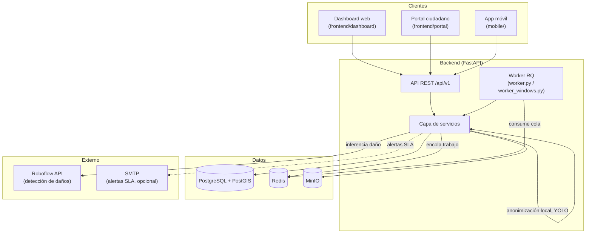

# Arquitectura

[← Volver al índice](README.md)

## Tabla de contenido

- [Estilo arquitectónico](#estilo-arquitectónico)
- [Componentes principales](#componentes-principales)
- [Comunicación entre componentes](#comunicación-entre-componentes)
- [Flujo de datos](#flujo-de-datos)
- [Límites del sistema](#límites-del-sistema)
- [Decisiones arquitectónicas importantes](#decisiones-arquitectónicas-importantes)
- [Riesgos y deuda técnica](#riesgos-y-deuda-técnica)

## Estilo arquitectónico

Monorepo con **arquitectura de servicios desacoplados por cliente**: un backend API central (FastAPI) sirve a tres clientes independientes (dashboard web, portal ciudadano web, app móvil), todos consumiendo el mismo contrato REST versionado (`/api/v1`). El backend en sí sigue una organización por capas (routers → servicios → modelos), no una arquitectura hexagonal o de microservicios estricta — es un monolito modular.

El módulo `ml/` es un componente **desacoplado y offline**: no se ejecuta como servicio en producción, solo produce artefactos (modelos, métricas) que se intercambian manualmente vía MinIO o Google Drive.

## Componentes principales

### Responsabilidades de cada componente

| Componente | Responsabilidad |
|---|---|
| `frontend/` (dashboard) | Gestión operativa de incidentes/reportes por supervisores y administradores |
| `frontend/` (portal) | Interfaz ciudadana web para crear y consultar reportes |
| `mobile/` | Interfaz ciudadana móvil, con captura de foto/GPS y modo offline local (sqflite) |
| `backend/api/` | Contrato HTTP, validación de entrada, autenticación/autorización por endpoint |
| `backend/services/` | Lógica de negocio: deduplicación, priorización, almacenamiento, notificaciones, anonimización |
| `backend/tasks/` + `worker.py` | Procesamiento asíncrono: inferencia ML por reporte, chequeo periódico de SLA |
| `ml/` | Entrenamiento y experimentación offline de modelos de detección de daños; no se sirve en producción |
| `infra/` | Configuración de red/proxy (Nginx) y orquestación local de MinIO |

## Comunicación entre componentes

- **Clientes → Backend**: HTTP/REST sobre JSON, autenticado con JWT Bearer (`Authorization: Bearer <token>`).
- **Backend → PostgreSQL**: SQLAlchemy ORM (sync), vía `backend/db/session.py`.
- **Backend → Redis**: dos usos distintos — cola de trabajos (RQ) y, potencialmente, caché (confirmar en `core/config.py` si se usa para algo más que colas).
- **Backend → MinIO**: SDK oficial de MinIO (S3-compatible), con fallback a disco local si el servicio no está disponible (`services/storage.py`).
- **Backend → Roboflow**: HTTP saliente a `serverless.roboflow.com` (inferencia) y `api.roboflow.com` (métricas del modelo), con fallback a un detector simulado si no hay `ROBOFLOW_API_KEY` configurada.
- **Worker → Redis → Backend**: el worker consume trabajos encolados por el backend (`enqueue_ml_detection`) y escribe resultados de vuelta en PostgreSQL a través de las mismas capas de servicio.
- **`ml/` → MinIO**: intercambio manual/batch de artefactos de entrenamiento (`scripts/upload_to_minio.py`, `download_from_minio.py`), sin llamada de código directa desde el backend.

## Flujo de datos

Ver diagrama de secuencia del flujo de creación de reporte en [PROJECT_OVERVIEW.md](PROJECT_OVERVIEW.md#flujo-general-de-funcionamiento).

Flujo de autenticación (frontend):

1. El usuario envía credenciales a `POST /api/v1/auth/login`.
2. El backend responde con un JWT de acceso (`SECRET_KEY`, algoritmo HS256, expira en `ACCESS_TOKEN_EXPIRE_MINUTES`).
3. El frontend guarda el token en `localStorage` bajo la clave `sirccd-auth-storage` (vía Zustand `persist`).
4. Un interceptor de Axios (`frontend/src/services/api.ts`) adjunta el token a cada request saliente.
5. Ante una respuesta `401`, el interceptor limpia el almacenamiento local y redirige a `/login`.
6. La protección de rutas del dashboard depende del hook `useAuth()` ejecutado en el cliente — **no hay verificación a nivel de servidor** (sin `middleware.ts` de Next.js).

## Límites del sistema

- El backend es la única fuente de verdad de los datos; ningún cliente accede directamente a PostgreSQL, Redis o MinIO.
- `ml/` está fuera del límite de despliegue: sus artefactos deben pasar por MinIO o integrarse manualmente antes de poder usarse en producción.
- La detección de daños en producción depende de un servicio externo (Roboflow) fuera del control del equipo — es un límite de confiabilidad externo, no solo arquitectónico.
- Mobile y frontend son clientes independientes que no comparten código (no hay una capa compartida de tipos/contratos entre TypeScript y Dart); cualquier cambio de contrato de API debe replicarse manualmente en ambos.

## Decisiones arquitectónicas importantes

Ver [decisions/ADR-001-current-architecture.md](decisions/ADR-001-current-architecture.md) para el registro formal. En resumen:

- **Monolito modular en el backend**, en vez de microservicios — reduce complejidad operativa para un equipo pequeño, a costa de acoplar ML pesado (torch/transformers) al mismo proceso que sirve la API.
- **Detección de daños vía Roboflow (SaaS) en vez de modelo propio servido** — permite avanzar en producción sin esperar a que el entrenamiento en `ml/` esté listo, a costa de una dependencia externa y potencial costo recurrente.
- **Autenticación stateless con JWT** en vez de sesiones de servidor — simplifica escalado horizontal del backend, pero requiere manejo cuidadoso de expiración/revocación (no hay lista de revocación de tokens documentada).
- **Fallbacks locales para MinIO y Roboflow** — decisión defensiva para desarrollo local sin todos los servicios levantados, pero introduce el riesgo de degradación silenciosa en producción si un fallback se activa por error de configuración (ver [REPOSITORY_AUDIT.md](REPOSITORY_AUDIT.md#8-riesgos-detectados)).

## Riesgos y deuda técnica

Ver el detalle completo, clasificado por severidad, en [REPOSITORY_AUDIT.md](REPOSITORY_AUDIT.md#8-riesgos-detectados). Los más relevantes desde una perspectiva arquitectónica:

- Ausencia de protección de rutas a nivel de servidor en el frontend.
- Ausencia de CI/CD para frontend, mobile y `ml/`.
- Acoplamiento de dependencias ML pesadas (`torch`, `transformers`, `faiss-cpu`) directamente en el backend, en vez de aislarlas en un servicio de inferencia separado.
