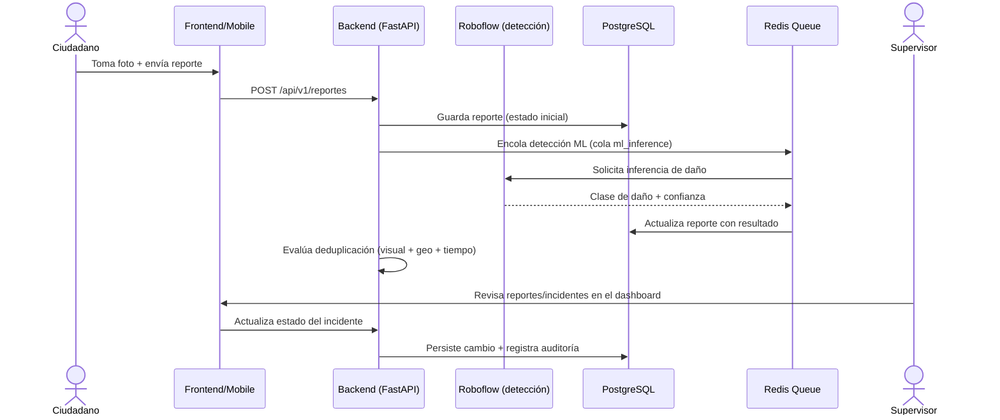

# Visión general del proyecto

[← Volver al índice](README.md)

## Propósito del sistema

SIRCCD (Sistema Inteligente Urbano para Reporte y Priorización de Daños Viales) permite a ciudadanos reportar daños en la vía pública (baches, grietas) mediante fotos georreferenciadas, y a un equipo operativo (supervisores/administradores) gestionar esos reportes como incidentes: verificarlos, priorizarlos, asignarlos y darles seguimiento hasta su resolución dentro de un plazo de servicio (SLA).

## Problema que resuelve

El reporte tradicional de daños viales (llamadas telefónicas, quejas dispersas) no permite priorizar objetivamente qué reparar primero ni verificar que un reporte sea real y no un duplicado del mismo daño reportado por varias personas. SIRCCD introduce:

- Reportes ciudadanos con foto + ubicación GPS.
- Detección automática de daño en la imagen (clasificación del tipo de daño).
- Deduplicación automática de reportes que corresponden al mismo daño físico (por similitud visual + proximidad geográfica + ventana de tiempo).
- Priorización basada en proximidad a puntos de interés sensibles (hospitales, escuelas, estaciones de bomberos/policía, puentes).
- Seguimiento de incidentes con SLA y alertas de vencimiento.

## Tipos de usuarios

| Rol | Descripción | Superficie que usa |
|---|---|---|
| Ciudadano | Reporta daños con foto y ubicación, consulta sus propios reportes | Portal ciudadano (frontend `/portal`) y app móvil |
| Supervisor | Revisa y gestiona incidentes, actualiza estados, ve el mapa operativo | Dashboard (frontend `/dashboard/*`) |
| Administrador | Todo lo del supervisor, más gestión de usuarios y configuración de prioridades | Dashboard (frontend `/dashboard/users`, `/dashboard/settings`) |

Roles definidos en `backend/models/user.py` (`UserRole`) y aplicados vía RBAC en `backend/api/deps.py`.

## Funcionalidades principales

- Registro y envío de reportes ciudadanos con imagen (backend `POST /api/v1/reportes`).
- Detección automática de tipo de daño vía Roboflow (servicio externo de inferencia).
- Deduplicación visual/geográfica/temporal de reportes (`backend/services/`, endpoints `/api/v1/deduplication`).
- Conversión de reportes verificados en incidentes gestionables, con estados y transición controlada (`backend/models/incident.py`, `STATUS_TRANSITIONS` en frontend).
- Cálculo de prioridad según proximidad a puntos de interés (POIs).
- Seguimiento de SLA con alertas por vencimiento próximo (tarea programada `check_sla_alerts`).
- Mapa operativo con capa de calor de incidentes (`react-leaflet`, `leaflet.heat`).
- Exportación de datos/reportes (`backend/api/routes/export.py`, dependencia `reportlab` para PDF).
- Anonimización automática de rostros/placas en las imágenes subidas (`backend/services/anonymizer.py`).
- App móvil para ciudadanos con captura de foto, GPS y modo con almacenamiento local (`mobile/`).
- Guía de usuario pública en `/guia` (frontend), sin necesidad de sesión. Versión en documento: [MANUAL_USUARIO.md](MANUAL_USUARIO.md).

## Componentes del proyecto

Ver detalle completo en [ARCHITECTURE.md](ARCHITECTURE.md). Resumen:

- **`backend/`** — API FastAPI, lógica de negocio, base de datos, cola de tareas.
- **`frontend/`** — Dashboard operativo + portal ciudadano web (Next.js).
- **`mobile/`** — App ciudadana Flutter.
- **`ml/`** — Entrenamiento/experimentación de modelos de detección de daños (offline, vía Colab) y módulo de anonimización usado en producción.
- **`infra/`** — Configuración de Nginx y Docker Compose para MinIO local.

## Flujo general de funcionamiento

## Tecnologías principales

Ver tabla completa en [REPOSITORY_AUDIT.md](REPOSITORY_AUDIT.md#2-tecnologías-encontradas). En breve: FastAPI + PostGIS + Redis + MinIO en el backend, Next.js + TypeScript en el frontend, Flutter en mobile, YOLO/Ultralytics para el entrenamiento de modelos de detección.

## Estado actual del proyecto

Desarrollo activo (último commit en `main`: 2026-07-19). El backend está desplegado en Railway; el frontend también se despliega vía Docker/Railway. El módulo `ml/` está en fase de entrenamiento/experimentación — el modelo de detección en producción actualmente corre en la API externa de Roboflow, no en un modelo propio servido desde este repositorio.

## Limitaciones conocidas

- La protección de rutas del dashboard es únicamente del lado cliente (no hay `middleware.ts` de Next.js).
- Sin CI para `mobile/` ni `ml/`; el backend y el E2E del frontend sí corren en cada PR (ver [infrastructure/CI_CD.md](infrastructure/CI_CD.md)).
- El modelo propio de detección de daños (entrenado en `ml/`) todavía no reemplaza al servicio externo de Roboflow en producción.
- El E2E del frontend cubre rutas públicas, portal ciudadano y humo del dashboard, pero no el flujo completo de creación de reporte con imagen (subida + inferencia + deduplicación).
