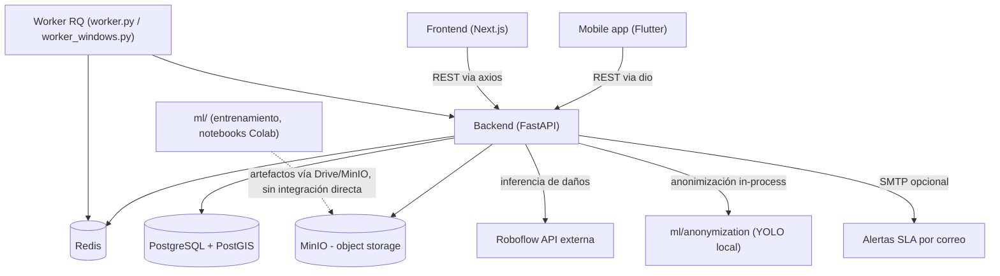

# Auditoría del repositorio — SIRCCD Monorepo

> Documento generado como Fase 1 de un proceso de limpieza y documentación incremental. **No se realizó ningún cambio de código en esta fase.** Todo lo aquí descrito refleja el estado real del repositorio en el momento del análisis (commit más reciente en `main`: `794bb05`, 2026-07-17).

> **Estado al 2026-07-19** — la mayoría de los hallazgos de este documento ya están resueltos (marcados `✅`/tachados inline). Lo que **sigue genuinamente abierto**, verificado contra el repositorio real en esta fecha:
>
> - `frontend/src/pages/.gitkeep` — carpeta residual del Pages Router, aún presente, aún referenciada en el glob de `tailwind.config.js` (sección 5).
> - `infra/ci-cd/.gitkeep`, `infra/docker/.gitkeep` — siguen vacías (sección 5).
> - `frontend/src/lib/` vs `frontend/src/utils/` — split sin resolver, marcado deliberadamente "No recomendado" tocar sin un refactor dedicado (sección 9).
> - Todos los ítems de la sección 8 marcados sin tachar (protección de rutas solo en cliente, ausencia de CI para frontend/mobile/ml, ausencia de workflow de despliegue, fallbacks silenciosos sin alerta, formato irregular de `worker_windows.py`) — siguen abiertos, marcados "No recomendado" para esta limpieza (son decisiones de arquitectura/feature, no de organización).
> - Ver [CLEANUP_REPORT.md](CLEANUP_REPORT.md) para deuda técnica adicional descubierta después de este documento (cobertura de tests, endpoints sin probar).

## Tabla de contenido

- [1. Resumen del estado actual](#1-resumen-del-estado-actual)
- [2. Tecnologías encontradas](#2-tecnologías-encontradas)
- [3. Componentes identificados](#3-componentes-identificados)
- [4. Diagrama general de dependencias](#4-diagrama-general-de-dependencias)
- [5. Problemas de organización encontrados](#5-problemas-de-organización-encontrados)
- [6. Código potencialmente obsoleto](#6-código-potencialmente-obsoleto)
- [7. Archivos potencialmente mal ubicados](#7-archivos-potencialmente-mal-ubicados)
- [8. Riesgos detectados](#8-riesgos-detectados)
- [9. Acciones recomendadas](#9-acciones-recomendadas)
- [10. Estado de git pendiente de cerrar](#10-estado-de-git-pendiente-de-cerrar)

---

## 1. Resumen del estado actual

SIRCCD (Sistema Inteligente Urbano para Reporte y Priorización de Daños Viales) es un monorepo activo en desarrollo continuo desde 2025-12-10, con el último commit el 2026-07-17. Contiene:

- Un **backend** FastAPI en producción (Railway), con base de datos PostGIS, cola de tareas Redis/RQ, almacenamiento MinIO e inferencia ML vía API externa (Roboflow).
- Un **frontend** Next.js 14 (App Router) desplegado en Railway, con dashboard operativo y portal ciudadano.
- Un módulo de **machine learning** (`ml/`) mayormente desacoplado del backend en producción: sirve como banco de pruebas/entrenamiento (notebooks de Colab, YOLO) para un modelo de detección de daños que en producción se sirve vía Roboflow, y para un pipeline de anonimización (blur de rostros/placas) que sí se ejecuta en el backend.
- Una **app móvil** Flutter con arquitectura limpia (clean architecture), BLoC/Cubit, go_router y almacenamiento seguro.
- Infraestructura (`infra/`) parcialmente vacía (varias carpetas solo contienen `.gitkeep`), con nginx y compose para MinIO.
- Un único workflow de CI (`backend-tests.yml`); no existe CI para frontend, ml ni mobile, ni workflow de despliegue.

El repositorio recibió limpieza previa en esta misma sesión (eliminación de una carpeta `docs/` desactualizada, un submódulo huérfano `sirccd-monorepo/sirccd-monorepo`, y código muerto en backend/frontend — ver [sección 10](#10-estado-de-git-pendiente-de-cerrar)). Esta auditoría documenta el estado **después** de esa limpieza inicial pero **antes** de cualquier reorganización estructural adicional.

## 2. Tecnologías encontradas

| Área | Tecnología |
|---|---|
| Backend | Python 3, FastAPI, SQLAlchemy 2.x, Alembic, Pydantic v2, PostGIS (vía GeoAlchemy2) |
| Cola de tareas | Redis, RQ (Redis Queue) |
| Almacenamiento de objetos | MinIO |
| Autenticación | JWT (python-jose), bcrypt/passlib |
| ML en backend | PyTorch, torchvision, transformers, FAISS, scikit-learn, OpenCV (deduplicación visual + anonimización) |
| ML externo | Roboflow (inferencia de detección de daños vía API hospedada) |
| Frontend | Next.js 14 (App Router), TypeScript, React 18, Zustand, Tailwind CSS, react-leaflet, recharts, i18next |
| Mobile | Flutter/Dart, flutter_bloc (Cubit), go_router, dio, flutter_secure_storage, sqflite, get_it |
| ML training | Ultralytics YOLO, Albumentations, Weights & Biases, geopandas (offline, vía Colab) |
| Infraestructura | Docker, Docker Compose, Nginx, Railway (deploy) |
| CI | GitHub Actions (solo backend) |
| Testing | pytest (backend), Playwright (frontend, un solo spec), Flutter test (mobile) |

## 3. Componentes identificados

### 3.1 Backend (`backend/`)

- **Puntos de entrada**: `main.py` (API FastAPI), `worker.py` (worker RQ para Linux/Railway), `worker_windows.py` (variante Windows sin `fork`).
- **Capas**: `api/routes/` (routers), `api/deps.py` (dependencias/RBAC), `core/` (config, seguridad, cifrado de campos, métricas), `models/` (SQLAlchemy ORM), `schemas/` (Pydantic), `services/` (lógica de negocio), `tasks/` (jobs RQ), `db/` (engine/sesión).
- **Routers activos**: `auth`, `deduplication`, `reportes` (`reports.py`), `admin/settings`, `incidents`, `pois`, `export`, `users`, `zones`, `health`.
- **Autenticación**: JWT HS256, RBAC por rol (`admin`/`supervisor`/otros) vía `require_role` en `api/deps.py`.
- **Tareas en segundo plano**: cola `ml_inference` (detección ML por reporte) y `default`; tarea programada `check_sla_alerts` para alertas de incumplimiento de SLA.
- **Base de datos**: 9 tablas (`incidents`, `incident_audit_logs`, `metrics`, `pois`, `priority_settings`, `reports`, `sla_configs`, `users`, `zones`), 9 migraciones Alembic.
- **Integraciones externas**: MinIO (con fallback a disco local), Roboflow (con fallback a detector mock si no hay API key), SMTP opcional (alertas SLA).
- **Pruebas**: pytest con marcadores por tipo (unit/integration/contract/slow/auth/...), suite de contrato basada en `schemathesis`, y 21 scripts de verificación manual en `tests/manual/` no cubiertos por CI.

### 3.2 Frontend (`frontend/`)

- **Framework**: Next.js 14 App Router, sin rutas API internas (`route.ts`) — todo el acceso a datos va al backend.
- **Superficies**: dashboard operativo (`/dashboard/*`: incidentes, reportes, SLA, usuarios, configuración) y portal ciudadano (`/portal`), cada uno con su propio layout.
- **Estado**: Zustand con 3 stores (`authStore` persistido en `localStorage`, `incidentsStore`, `uiStore`).
- **Capa de servicios**: un archivo por recurso backend (`authService`, `incidentsService`, `poisService`, `prioritySettingsService`, `reportsService`, `usersService`, `zonesService`) sobre un cliente Axios central (`api.ts`).
- **Autenticación**: protección de rutas 100% del lado cliente vía el hook `useAuth()`; no existe `middleware.ts` de Next.js para protección a nivel de servidor.
- **i18n**: `react-i18next`, locales `es`/`en`.
- **Pruebas**: un único spec de Playwright (`tests/portal.spec.ts`) cubriendo el portal ciudadano; no hay pruebas unitarias ni del dashboard.

### 3.3 Machine Learning (`ml/`)

- **Propósito**: (a) detección de daños viales (baches/grietas) — actualmente en fase de entrenamiento/experimentación con YOLO (Ultralytics), mientras producción usa Roboflow; (b) anonimización de imágenes (blur de rostros y placas) — este sí se ejecuta en producción vía `backend/services/anonymizer.py`, que importa YOLO directamente.
- **Desacoplamiento**: `ml/` no se despliega como servicio; los notebooks corren en Google Colab y los artefactos (pesos, datasets) se mueven vía Google Drive o MinIO, no se versionan en git.
- **Artefactos versionados**: solo métricas/configuración de una corrida base (`ml/models/baseline/`), sin pesos `.pt`.
- **Carpetas vacías** (solo `.gitkeep`): `deduplication/`, `embeddings/`, `inference/`, `train/`, `utils/` — planificadas pero sin contenido.

### 3.4 Mobile (`mobile/`)

- **Framework**: Flutter con arquitectura limpia por feature (`lib/features/{auth,camera,permissions,profile,reports}/` con capas `data/domain/presentation`).
- **Estado**: `flutter_bloc` (patrón Cubit).
- **Navegación**: `go_router`.
- **Persistencia/seguridad**: `flutter_secure_storage` para tokens, `sqflite` para datos offline.
- **Permisos**: cámara y ubicación declarados correctamente en Android/iOS manifests, con módulo dedicado `lib/features/permissions/`.

### 3.5 Infraestructura (`infra/`, raíz)

- `infra/nginx/` — configuración Nginx + generación de certificados de desarrollo.
- `infra/compose/docker-compose.minio.yml` — MinIO para desarrollo local.
- `infra/ci-cd/` y `infra/docker/` — **vacías** (solo `.gitkeep`), sin contenido real todavía.
- `docker-compose.yml` / `docker-compose.prod.yml` — en la raíz del repo (no dentro de `infra/`), configuración principal de orquestación.
- `.github/workflows/backend-tests.yml` — único pipeline de CI, cubre solo backend.

## 4. Diagrama general de dependencias

**Nota**: `ml/` (entrenamiento) está representado con línea punteada porque no tiene una dependencia de código directa con `backend/` — solo comparte el bucket de MinIO como medio de intercambio de artefactos. La única integración de código real entre `backend/` y `ml/` es el módulo de anonimización.

## 5. Problemas de organización encontrados

| Problema | Ubicación | Detalle |
|---|---|---|
| ~~`README.md` raíz desactualizado~~ | ~~`README.md`~~ | **Resuelto en Fase 2**: reescrito con rutas reales (`scripts/dev.ps1`, `infra/compose/docker-compose.minio.yml`), corregido un typo ("do#" al inicio del título) y la descripción de mobile como "espacio reservado" (ya está implementado). |
| Dataset ajeno dentro de `ml/` | ~~`ml/datasets/pois_google/`~~ → `backend/db/seed/pois_google/` | Contenía datos semilla de PostgreSQL (GeoJSON + `pois_insert.sql`) para la tabla `pois`, no datos de entrenamiento ML. **Reubicado en Fase 4** — ver sección 9. |
| ~~Cuatro scripts de arranque de backend redundantes~~ | ~~`backend/start.py`, `start_server.py`, `start.sh`, `start.bat`~~ | **Resuelto en Fase 4**: eliminados `start.py` y `start_server.py` (ninguno referenciado por Dockerfile/CI; solo un `print()` en `tests/manual/test_auth_manual.py` sugería `python start_server.py`, corregido a `python main.py`). Se conservaron `start.sh` y `start.bat` — son los scripts equivalentes por sistema operativo, con lógica de setup de entorno virtual + `.env` + instalación de dependencias, sin solapamiento entre sí. |
| Utilidades del frontend en dos ubicaciones paralelas | `frontend/src/lib/` vs `frontend/src/utils/` | `lib/` tiene `exifGps.ts`, `geocode.ts`; `utils/` tiene `cn.ts`, `labels.ts`. No hay duplicación literal, pero la separación no es evidente para un desarrollador nuevo. |
| Carpeta `src/pages/` residual | `frontend/src/pages/` | Vacía salvo `.gitkeep`, remanente del Pages Router (proyecto usa App Router). Sigue referenciada en el glob de contenido de `tailwind.config.js`. |
| Carpetas de infraestructura vacías | `infra/ci-cd/`, `infra/docker/` | Sin contenido real; o se plantea qué van a contener, o se elimina el placeholder. |
| ~~Notebooks de entrenamiento sin poda~~ | ~~`ml/notebooks/SIRCCD_Training_v3_FromScratch.ipynb`, `_v4_YOLO11l`, `_v5_H100_Optimized`~~ | **Resuelto**: confirmado que `v5_H100_Optimized` es el vigente; `v3`/`v4` movidos a `ml/notebooks/archive/`. Referencias corregidas en `ml/docs/GUIA_MEJORAS_MODELO.md`, `GUIA_CONTINUAR_ENTRENAMIENTO.md`, `V3_TRAINING_OPTIMIZATION.md` (el primero marcaba a v3 con ⭐ como recomendado, contradecía la versión vigente confirmada). |

## 6. Código potencialmente obsoleto

> Ninguno de estos elementos fue eliminado en esta fase. Requieren validación antes de tocarlos.

| Elemento | Ubicación | Por qué es sospechoso | Validación necesaria antes de eliminar |
|---|---|---|---|
| `QueueService` y helpers en desuso | *(ya resuelto)* | `clear_queue()` fue eliminado en la limpieza previa de esta sesión tras confirmar cero referencias. | — (ya aplicado) |
| ~~Scripts de mantenimiento con backfills antiguos~~ | ~~`backend/scripts/maintenance/backfill_priority_breakdown.py`, `backfill_report_duplicate_of.py`, `backfill_merged_report_links.py`~~ | Ligados a migraciones ya aplicadas (007/008). | **Resuelto**: 0 candidatos pendientes en producción para los 3 scripts, confirmado por consulta directa a la BD. Eliminados. |
| ~~Cuatro scripts de arranque redundantes en backend~~ | ~~Ver sección 5~~ | ~~No usados por Docker ni CI.~~ | **Resuelto en Fase 4** — ver sección 5. |
| `tests/pytest.log` | `backend/tests/pytest.log` | Artefacto de ejecución local. **Corrección tras verificar con `git ls-files`**: no estaba trackeado por git (ya cubierto por `*.log` en `.gitignore`) — el hallazgo original de este documento decía "commiteado por accidente", lo cual era incorrecto; era solo clutter en disco local. | Resuelto en Fase 4: archivo eliminado del disco (no requería `git rm`). |
| `frontend/tsconfig.tsbuildinfo` | raíz de `frontend/` | Artefacto de build de TypeScript, normalmente no se versiona. | Confirmar que `.gitignore` no lo excluye ya por error; si no está ignorado, añadirlo y eliminar el tracked. |
| `.gitkeep` residuales en carpetas ya pobladas | `frontend/src/components/.gitkeep`, `src/store/.gitkeep`, `src/hooks/.gitkeep` | Estas carpetas ya tienen contenido real, el placeholder es innecesario. | Bajo riesgo — candidato a eliminar directamente. |
| `frontend/docs/W-04-MAPA-IMPLEMENTACION.md` | `frontend/docs/` | Documento de una implementación específica (mapa), fecha de último commit 2026-03-24; no se pudo confirmar si sigue vigente o es notas de una feature ya cerrada. | Revisar contenido manualmente contra el estado actual de `MapView.tsx`/`PortalMap.tsx` antes de decidir. |

## 7. Archivos potencialmente mal ubicados

| Archivo/carpeta | Ubicación actual | Ubicación esperada | Nota |
|---|---|---|---|
| `pois_google/*.geojson`, `pois_insert.sql` | ~~`ml/datasets/pois_google/`~~ | `backend/db/seed/pois_google/` ✅ movido en Fase 4 | Era dato semilla de base de datos (POIs: hospitales, escuelas, etc.), no dataset de entrenamiento. |
| `docker-compose.minio.yml` | `infra/compose/docker-compose.minio.yml` | Correcto según estructura actual, pero el `README.md` raíz lo describe como si estuviera en la raíz — desalineación de documentación, no del archivo en sí. |
| Scripts de arranque de backend | `backend/start.py`, `start_server.py`, `start.sh`, `start.bat` | Si se mantienen, agruparlos bajo `backend/scripts/dev/` para diferenciarlos de los scripts de mantenimiento/verificación. |

No se encontraron archivos con patrones típicos de copias temporales (`-old`, `-backup`, `-copy`, `-final`, `.bak`, `.orig`, `TODO_DELETE`) en el repositorio.

## 8. Riesgos detectados

| Riesgo | Severidad | Detalle |
|---|---|---|
| ~~`SECRET_KEY` con valor por defecto hardcodeado~~ | ~~Alto~~ | **Resuelto**: verificado contra las variables reales de Railway — `SECRET_KEY` en producción difiere del default de `core/config.py` (64 caracteres, no coincide). El código sigue teniendo el default hardcodeado (no se tocó, es una decisión de diseño válida como fallback de desarrollo), pero producción no depende de él. |
| ~~`.env.example` incompleto~~ | ~~Medio~~ | **Resuelto en Fase 4** — `.env.example` ahora incluye las ~35 variables que `core/config.py` realmente lee, con nombres y defaults verificados directamente contra el código (no aproximados), agrupadas por área y con valores ficticios/seguros. |
| Protección de rutas del frontend solo en cliente | Medio | No existe `middleware.ts` de Next.js; la protección de `/dashboard/*` depende enteramente del hook `useAuth()` en el cliente. Cualquier fuga de HTML/datos antes de la hidratación de React debe ser evaluada por el equipo de seguridad. |
| Ausencia de CI para frontend, mobile y ml | Medio | Solo existe `backend-tests.yml`. Cambios en frontend/mobile se despliegan sin verificación automática de tests/build en PR. |
| Ausencia de workflow de despliegue versionado | Bajo-Medio | `docker-compose.prod.yml` existe pero no hay un workflow de CI/CD que lo use — el despliegue a Railway parece manual o gestionado fuera del repo. |
| Fallbacks silenciosos en integraciones externas | Bajo | `services/ml_service.py` cae a un detector mock si `ROBOFLOW_API_KEY` está vacío, y `services/storage.py` cae a disco local si MinIO no está disponible. Esto es buen diseño defensivo, pero si ocurre en producción por error de configuración, degradaría silenciosamente la funcionalidad sin alertar. Vale la pena confirmar que existe logging/alerta visible cuando se activa un fallback. |
| Worker de Windows con formato irregular | Bajo | `backend/worker_windows.py` tiene indentación de un espacio, inconsistente con el resto del código — no es un riesgo funcional confirmado, pero dificulta el mantenimiento y sugiere que no pasó por el mismo proceso de formateo que el resto del backend. |

## 9. Acciones recomendadas

Clasificadas según el criterio pedido: **Seguro**, **Riesgo bajo**, **Requiere validación**, **No recomendado**.

### Seguro (aplicable en la fase de limpieza, Fase 4)

- ✅ Eliminar `backend/tests/pytest.log` (artefacto de ejecución local, no trackeado por git) — hecho en Fase 4.
- ✅ Eliminar `.gitkeep` en `frontend/src/components/`, `src/store/`, `src/hooks/` (carpetas ya pobladas) — hecho en Fase 4.
- ✅ Confirmar que `frontend/tsconfig.tsbuildinfo` esté en `.gitignore` — ya estaba cubierto por el patrón `*.tsbuildinfo` (línea 222) y nunca estuvo trackeado; no requirió acción.
- ✅ Actualizar `README.md` raíz para reflejar rutas reales — hecho en Fase 2.

### Riesgo bajo (requiere una verificación rápida antes de aplicar)

- ✅ Mover `ml/datasets/pois_google/` a una ubicación de seed de base de datos — hecho en Fase 4, ahora en `backend/db/seed/pois_google/`. No se encontraron referencias de código a la ruta anterior (solo esta documentación), por lo que no hizo falta actualizar scripts de importación.
- ✅ Completar `.env.example` (raíz) con las variables detectadas como faltantes (sección 8) — hecho en Fase 4.
- ✅ Consolidar los 4 scripts de arranque de backend — hecho en Fase 4. Eliminados `start.py` y `start_server.py` (redundantes, sin referencias externas reales); conservados `start.sh`/`start.bat` como scripts equivalentes por sistema operativo.

### Requiere validación manual (no ejecutar sin confirmación humana)

- ✅ Eliminar los 3 scripts de backfill en `backend/scripts/maintenance/` — verificado en producción vía consulta directa a la BD: 0 candidatos pendientes en los 3 casos (`priority_breakdown`, `duplicate_of_report_id`, enlaces de reportes fusionados). Eliminados.
- ✅ Archivar notebooks de ML superados (`v3`, `v4`) — hecho, confirmado por el usuario que `v5` es la vigente.
- ✅ Revisar y retirar `frontend/docs/W-04-MAPA-IMPLEMENTACION.md` — leído y comparado con `MapView.tsx` actual: describía v1.0.0 (marzo 2026) sin filtros/heatmap/capas POI, referenciaba `components/index.ts` y el tipo `IncidentListResponse` ya eliminados en la Fase 2 de esta limpieza, y un centro de mapa (Santo Domingo) distinto al real (Santiago de los Caballeros). Eliminado con confirmación del usuario.
- ✅ **Resuelto**: `SECRET_KEY`, `FIELD_ENCRYPTION_KEY`, `POSTGRES_PASSWORD`, `REDIS_PASSWORD`, `MINIO_SECRET_KEY` confirmados como variables de entorno reales en Railway (`railway variables --service backend`). `SECRET_KEY` verificado explícitamente distinto del default hardcodeado en `core/config.py` (64 caracteres, no coincide). Ningún valor real fue expuesto en esta verificación.

### No recomendado (fuera de alcance de esta limpieza)

- Añadir `middleware.ts` de Next.js para protección de rutas a nivel de servidor — es un cambio de comportamiento funcional/arquitectónico, no una limpieza; debe tratarse como una feature aparte con su propio diseño y pruebas.
- Añadir workflows de CI/CD para frontend, mobile y despliegue — igual que el punto anterior, es una decisión de ingeniería que excede "organizar y documentar" y debe abordarse como iniciativa propia.
- Reestructurar la arquitectura de carpetas `lib/` vs `utils/` en el frontend — el riesgo de romper imports en un cambio amplio no compensa el beneficio cosmético; documentar la convención existente es preferible a forzar una migración.

## 10. Estado de git pendiente de cerrar

> **Resuelto** — esta sección es ahora histórica. Todo lo descrito abajo fue commiteado en las Fases 1-4 (ver [CLEANUP_REPORT.md](CLEANUP_REPORT.md) para el detalle completo por commit). Se conserva sin editar como registro del estado en que se encontró el repositorio al empezar.

Al momento de esta auditoría, el árbol de trabajo tenía cambios **ya aplicados pero no commiteados** de una limpieza previa realizada en esta misma sesión:

- Eliminación completa de la carpeta `docs/` anterior (incluyendo PDFs y `.md` desactualizados).
- Eliminación del submódulo huérfano `sirccd-monorepo/sirccd-monorepo` (gitlink apuntando a un fork stale de 2026-05-13, sin `.gitmodules` registrado).
- Backend: eliminación de 2 dependencias sin uso (`faker`, `python-json-logger`) y del método muerto `QueueService.clear_queue()`.
- Frontend: eliminación de 11 archivos sin referencias (`Button.tsx`, `Card.tsx`, `SLAPanel.tsx`, `components/index.ts`, `store/reportsStore.ts`, `services/metricsService.ts`, `hooks/useAsync.ts`, `hooks/useMediaQuery.ts`, `hooks/useUpdateEffect.ts`, `utils/dates.ts`, `utils/geo.ts`) y de ~15 exports sin uso, verificado con `tsc --noEmit` y `npm run build` (ambos exitosos).

Estos cambios están en el working tree (`git status` los muestra como `M`/`D`) pero **no se han commiteado**, a la espera de decisión del usuario. Se recomienda cerrarlos (commit) antes de iniciar la Fase 2 de este proceso de documentación, para evitar mezclar en un mismo commit trabajo de limpieza de código con la nueva documentación generada.
