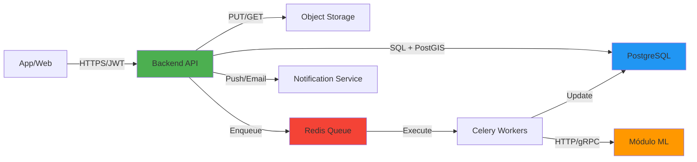
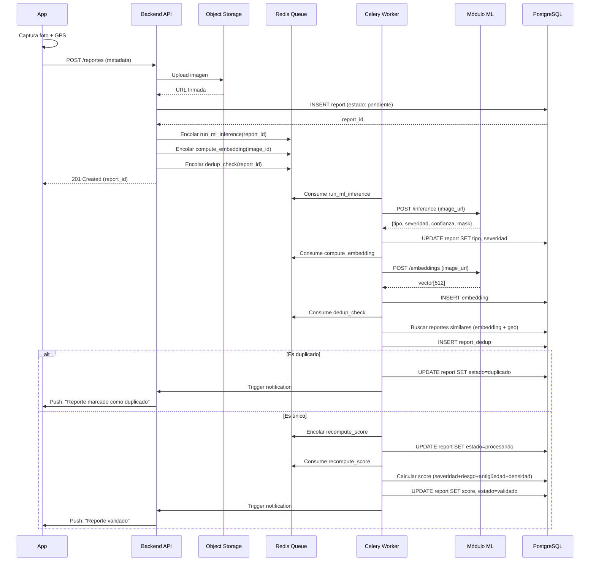
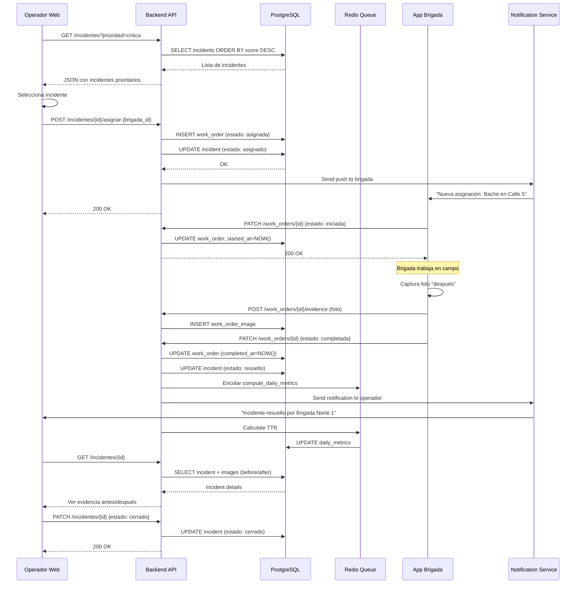
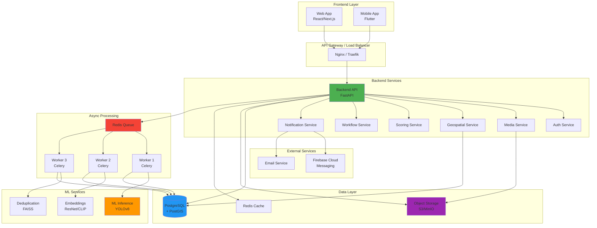

# Arquitectura Lógica del Sistema SIRCCD

## 🎯 Objetivo

Definir la arquitectura lógica del sistema, identificando componentes principales, módulos internos y cómo se comunican para soportar el flujo de:

**Reporte → Validación/ML → Priorización → Asignación → Cierre → Métricas**

---

## 🏗️ Componentes Principales

### A. Frontend (Web + App)

**Responsabilidad:** Interfaz para ciudadanos, brigadas, operadores y administradores.

#### 🌐 Web (Operador/Admin)

**Tecnología:** React/Next.js

**Funcionalidades:**

- **Panel de reportes**
  - Lista con filtros (estado, tipo, fecha, zona)
  - Vista de detalles con historial completo
  - Evidencias (antes/después)

- **Mapa interactivo**
  - Capas configurables (reportes, incidentes, brigadas, POIs)
  - Clusters dinámicos por zoom
  - Heatmaps de densidad
  - Filtros geográficos (dibujar polígono, radio)

- **Asignación a brigadas**
  - Workflow de aprobación
  - Rutas sugeridas
  - Carga de trabajo en tiempo real

- **Métricas/BI**
  - Dashboards interactivos
  - KPIs (F1, TTR, SLA, deduplicación)
  - Exportación de reportes

- **Configuración**
  - Ajuste de pesos del score de priorización
  - Gestión de catálogos
  - Administración de usuarios y roles

**Comunicación:** HTTPS/REST con autenticación JWT

---

#### 📱 App (Ciudadano/Brigada)

**Tecnología:** Flutter (iOS + Android)

**Funcionalidades:**

- **Crear reporte**
  - Captura de foto/video con cámara nativa
  - Descripción textual
  - Categoría opcional (bache/grieta/hundimiento)
  - Captura automática de GPS
  - Ubicación manual en mapa
  - Vista previa antes de enviar

- **Seguimiento**
  - Estado del reporte en tiempo real
  - Historial de cambios
  - Tiempo estimado de resolución
  - Evidencia de cierre (antes/después)

- **Notificaciones**
  - Push notifications
  - In-app notifications
  - Alertas de cambio de estado

- **Modo offline**
  - Cola local de reportes pendientes
  - Sincronización automática al recuperar conectividad
  - Indicador visual de estado de sincronización

**Comunicación:** HTTPS/REST con tokens JWT, reconexión automática

---

### B. Backend (API)

**Responsabilidad:** Núcleo del sistema (reglas de negocio, seguridad, persistencia, orquestación)

**Tecnología:** FastAPI (Python 3.10+)

#### Módulos del Backend

##### 1. 🔐 Auth & RBAC

**Funcionalidades:**
- Login opcional para ciudadanos
- Login obligatorio para roles operativos
- Gestión de tokens JWT (access + refresh)
- Control de acceso basado en roles (RBAC)

**Roles:**
- `ciudadano` - Crear reportes, ver historial propio
- `brigada` - Ver asignaciones, actualizar estado, subir evidencia
- `operador` - Gestionar reportes, asignar brigadas
- `supervisor` - Validación y supervisión
- `administrador` - Configuración completa del sistema

---

##### 2. 📋 Gestión de Reportes

**Funcionalidades:**
- CRUD completo de reportes
- Máquina de estados (pendiente → procesando → validado/rechazado/duplicado)
- Historial de cambios (auditoría)
- Búsqueda y filtrado avanzado
- Exportación de datos

**Estados:**
```
pendiente → procesando → validado
                      ↘ rechazado
                      ↘ duplicado
```

---

##### 3. 🖼️ Media Service

**Funcionalidades:**
- Validación de formatos (JPEG, PNG, MP4)
- Límites de tamaño
- Generación de URLs firmadas (pre-signed URLs)
- Procesamiento de imágenes:
  - Redimensionamiento
  - Compresión
  - Generación de thumbnails
- Antivirus opcional (ClamAV)
- Difuminado automático de rostros/placas

**Storage:** S3/MinIO/Google Cloud Storage

---

##### 4. 🌍 Geoespacial (PostGIS)

**Funcionalidades:**
- Consultas por radio (ST_DWithin)
- Búsqueda por bounding box
- Geocercas (polígonos administrativos)
- Agrupación por cercanía (clustering)
- Detección de duplicados geoespaciales
- Proximidad a POIs críticos

**Operaciones típicas:**
- Reportes en radio de 100m
- Brigada más cercana a incidente
- Incidentes en zona específica

---

##### 5. ⚡ Priorización / Scoring

**Funcionalidades:**
- Cálculo de score multicriterio (0-1)
- Pesos configurables por admin

**Fórmula:**
```
score = w1·severidad + w2·riesgo + w3·antigüedad + w4·densidad

Donde:
- severidad: área/longitud del daño (ML)
- riesgo: proximidad a POIs críticos (geoespacial)
- antigüedad: días desde primer reporte
- densidad: reportes similares en la zona
```

**Niveles de prioridad:**
- `critica`: score ≥ 0.80
- `alta`: 0.60 ≤ score < 0.80
- `media`: 0.40 ≤ score < 0.60
- `baja`: score < 0.40

---

##### 6. 🔄 Workflow Operativo

**Funcionalidades:**
- Asignación automática/manual a brigadas
- Gestión de SLA
- Cambios de estado con validaciones
- Reasignación
- Cierre con evidencia obligatoria
- Cálculo de TTR (Time to Resolution)

**Estados operativos:**
```
pendiente → asignado → en_proceso → resuelto → cerrado
         ↘ rechazado
```

---

##### 7. 🔔 Notificaciones

**Funcionalidades:**
- Push notifications (Firebase/OneSignal)
- Email (SMTP/SendGrid)
- In-app notifications
- Eventos configurables:
  - Reporte creado
  - Estado cambiado
  - Asignación a brigada
  - Resolución completada
  - SLA próximo a vencer

**Segmentación por rol:**
- Ciudadano: solo sus reportes
- Brigada: solo sus asignaciones
- Operador/Admin: eventos configurables

---

##### 8. 📊 Métricas & Auditoría

**Funcionalidades:**
- Log de eventos (quién, qué, cuándo)
- Agregaciones diarias/mensuales
- Métricas de rendimiento ML
- Dashboards en tiempo real
- Exportación de métricas

**KPIs principales:**
- Reportes totales/duplicados
- TTR promedio
- Cumplimiento de SLA
- F1-score del modelo
- Tasa de deduplicación
- Brigadas activas
- Incidentes por zona

---

### C. Módulo ML (Servicio Separado)

**Responsabilidad:** Procesamiento automático de imágenes para clasificación, severidad y deduplicación

**Tecnología:** Python, FastAPI, PyTorch/TensorFlow

#### Submódulos ML

##### 1. Preprocesamiento
- Resize a dimensiones del modelo (640x640)
- Normalización (ImageNet stats)
- Validación de calidad (blur detection)
- Aumento de datos (solo training)

##### 2. Inferencia de Severidad/Tipo
- Modelo: YOLOv8-seg
- Input: Imagen RGB
- Output:
  - Clase: bache/grieta/hundimiento
  - Confianza: 0-1
  - Máscara de segmentación
  - Área del daño (m²)

##### 3. Embeddings Visuales
- Modelo: ResNet50 o CLIP
- Output: Vector de 512/768 dimensiones
- Uso: Detección de duplicados visuales
- Índice: FAISS/Annoy para búsqueda rápida

##### 4. Post-procesamiento
- Umbrales de confianza (min 0.7)
- Calibración de scores
- Reglas anti-falsos positivos
- Filtrado de detecciones pequeñas

##### 5. Versionado
- Registro de `model_version`
- Métricas por versión
- A/B testing de modelos
- Rollback si es necesario

**Interfaz:** REST/gRPC interno, llamadas asíncronas

---

### D. Base de Datos (PostGIS)

**Responsabilidad:** Persistencia transaccional + capacidades geoespaciales

**Tecnología:** PostgreSQL 15+ con extensión PostGIS 3.x

#### Entidades Principales

| Tabla | Descripción |
|-------|-------------|
| `user_account` | Usuarios del sistema |
| `municipality` | Municipalidades |
| `brigade` | Brigadas de trabajo |
| `brigade_member` | Miembros de brigadas |
| `report` | Reportes ciudadanos |
| `report_image` | Evidencias fotográficas |
| `report_dedup` | Análisis de deduplicación |
| `incident` | Incidentes (reportes agrupados) |
| `work_order` | Órdenes de trabajo |
| `work_order_image` | Evidencia de resolución |
| `metric_event` | Eventos del sistema |
| `daily_metrics` | Métricas agregadas |

**Ver detalles completos:** [modelo_datos.md](./modelo_datos.md)

---

### E. Sistema de Colas / Asíncrono

**Responsabilidad:** Separar operaciones de usuario de trabajo pesado

**Tecnología:** Redis + Celery/RQ

#### Jobs Típicos

| Job | Prioridad | Tiempo aprox. |
|-----|-----------|---------------|
| `run_ml_inference(report_id)` | Alta | 2-5s |
| `compute_embedding(media_id)` | Media | 1-3s |
| `dedup_check(report_id)` | Media | 3-10s |
| `recompute_score(report_id)` | Media | <1s |
| `send_notification(event)` | Alta | <1s |
| `generate_thumbnail(image_id)` | Baja | 1-2s |
| `compute_daily_metrics()` | Baja | 30-60s |

**Workers:** 4-8 workers concurrentes según carga

---

## 🔗 Comunicación entre Módulos



### Resumen de Comunicación

| Desde | Hacia | Protocolo | Propósito |
|-------|-------|-----------|-----------|
| App/Web | Backend API | HTTPS (REST) | Operaciones CRUD, consultas |
| Backend API | PostgreSQL | SQL/PostGIS | Persistencia y consultas espaciales |
| Backend API | Object Storage | S3 API | Guardar/recuperar evidencias |
| Backend API | Redis Queue | TCP | Encolar tareas pesadas |
| Workers | Módulo ML | HTTP/gRPC | Solicitar inferencia/embeddings |
| Workers | PostgreSQL | SQL | Persistir resultados ML |
| Backend | Notificaciones | HTTP/SMTP | Emitir notificaciones |

---

## 🔄 Flujos Principales del Sistema

### Flujo 1: Crear Reporte (Ciudadano)



#### Descripción del Flujo

1. **App captura evidencia + ubicación**
   - Usuario toma foto con cámara
   - GPS captura lat/lng automáticamente
   - Opción de ajustar ubicación manualmente

2. **App envía metadatos al Backend**
   - POST `/reportes` con metadata JSON
   - Upload de imagen (directo a Storage o vía API)

3. **Backend crea report en PostgreSQL**
   - Estado inicial: `pendiente`
   - Timestamp de creación
   - Geolocalización como GEOGRAPHY(POINT)

4. **Backend encola tareas asíncronas**
   - `run_ml_inference`: clasificar y segmentar
   - `compute_embedding`: vector para deduplicación
   - `dedup_check`: buscar duplicados

5. **Workers ejecutan ML**
   - Inferencia de tipo de daño (bache/grieta/hundimiento)
   - Cálculo de severidad basado en área segmentada
   - Generación de embedding visual

6. **Deduplicación**
   - Comparación de embeddings (similitud coseno)
   - Verificación geoespacial (distancia < 100m)
   - Si es duplicado: marcar y vincular al reporte original
   - Si es único: calcular score de priorización

7. **Backend actualiza estado y notifica**
   - Estado: `validado` o `duplicado`
   - Push notification al ciudadano

---

### Flujo 2: Asignación y Cierre (Operación Municipal)



#### Descripción del Flujo

1. **Operador consulta mapa/lista**
   - Filtros: prioridad crítica, zona norte, últimas 24h
   - Ordenamiento: score descendente
   - Visualización en mapa con clusters

2. **Selecciona incidente y asigna a brigada**
   - Crear work_order
   - Asociar brigada disponible
   - Establecer SLA (ej: 24h para crítica)

3. **Brigada recibe notificación**
   - Push notification con detalles
   - Ubicación en mapa
   - Evidencia fotográfica

4. **Brigada cambia estado en campo**
   - `iniciada`: al llegar al sitio
   - Timestamp de inicio

5. **Al finalizar reparación**
   - Captura foto "después"
   - Sube evidencia
   - Marca como `completada`

6. **Sistema actualiza métricas**
   - TTR = completed_at - assigned_at
   - Cumplimiento de SLA
   - Actualización de daily_metrics

7. **Operador verifica y cierra**
   - Revisa evidencia antes/después
   - Valida calidad de reparación
   - Marca como `cerrado`

---

## 📊 Diagrama de Arquitectura Completo



---

## 🔐 Consideraciones de Seguridad

### Autenticación y Autorización
- JWT con refresh tokens
- Roles granulares (RBAC)
- Rate limiting por IP y usuario
- Validación de permisos en cada endpoint

### Datos Sensibles
- Difuminado automático de rostros/placas
- No almacenar imágenes originales sin procesar
- Encriptación en tránsito (TLS 1.3)
- Encriptación en reposo (PostgreSQL, S3)

### API Security
- CORS configurado correctamente
- Headers de seguridad (CSP, HSTS, X-Frame-Options)
- Sanitización de inputs
- Validación de tipos con Pydantic

---

## 📈 Escalabilidad

### Horizontal Scaling

| Componente | Estrategia |
|------------|-----------|
| Backend API | Múltiples instancias detrás de load balancer |
| Workers | Escalar workers según profundidad de cola |
| ML Services | Auto-scaling basado en latencia |
| PostgreSQL | Read replicas para consultas |
| Redis | Redis Cluster para alta disponibilidad |

### Vertical Scaling
- PostgreSQL: Incrementar RAM para cache
- ML Services: GPU para inferencia más rápida

### Caching
- Redis para:
  - Sesiones de usuario
  - Resultados de queries frecuentes
  - Embeddings recientes
- TTL configurables por tipo de dato

---

## 🔍 Monitoreo y Observabilidad

### Métricas Clave

**Aplicación:**
- Request rate (req/s)
- Error rate (%)
- Latencia p50, p95, p99
- Queue depth
- Worker utilization

**ML:**
- Inference time (ms)
- Model accuracy (F1, precision, recall)
- False positive rate
- Embedding computation time

**Base de Datos:**
- Connections activas
- Query time
- Cache hit rate
- Disk I/O

### Herramientas
- **Logs:** ELK Stack (Elasticsearch, Logstash, Kibana)
- **Métricas:** Prometheus + Grafana
- **Tracing:** Jaeger/OpenTelemetry
- **Alertas:** PagerDuty/Opsgenie

---

## 🧪 Testing

### Niveles de Testing

**Unitarios:**
- Lógica de scoring
- Validaciones de negocio
- Transformaciones de datos

**Integración:**
- API endpoints
- Workflows completos
- Interacción con PostGIS

**E2E:**
- Flujo completo: reporte → ML → asignación → cierre
- Tests de UI (Playwright/Cypress)

**Carga:**
- Simulación de 1000 reportes/hora
- Concurrencia de 500 usuarios
- Latencia bajo carga

---

## 📚 Referencias

- [OpenAPI Specification](../backend/api/openapi.yaml)
- [Modelo de Datos](./modelo_datos.md)
- [Matriz de Riesgos](../matriz_riesgos.md)

---

## 🤝 Contribución

Al modificar la arquitectura:

1. Actualizar diagramas en este documento
2. Validar impacto en otros componentes
3. Actualizar OpenAPI si afecta endpoints
4. Documentar migraciones necesarias
5. Comunicar cambios breaking al equipo

---

## 📄 Licencia

MIT License
