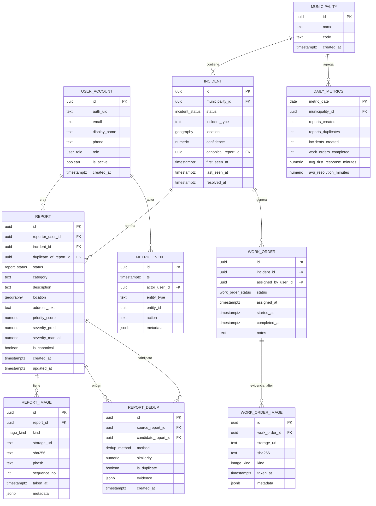

# Modelo de Datos - SIRCCD

## 📖 Descripción

Diseño de la base de datos relacional con extensión espacial (PostGIS) para el Sistema Inteligente Urbano para Reporte y Priorización de Daños Viales.

El modelo soporta:
- Gestión multiusuario con roles
- Reportes ciudadanos con geolocalización
- Deduplicación de reportes
- Agrupación en incidentes
- Órdenes de trabajo con evidencia antes/después
- Métricas y eventos del sistema

---

## 🗺️ Diagrama Entidad-Relación



---

## 📊 Entidades Principales

### 1. USER_ACCOUNT (Usuarios)

Gestiona cuentas de usuario del sistema.

| Campo | Tipo | Descripción |
|-------|------|-------------|
| `id` | UUID | PK - Identificador único |
| `auth_uid` | TEXT | ID de autenticación externa (Firebase, Auth0) |
| `email` | TEXT | Email único (índice) |
| `display_name` | TEXT | Nombre para mostrar |
| `phone` | TEXT | Teléfono opcional |
| `role` | ENUM | `ciudadano`, `administrador`, `supervisor` |
| `is_active` | BOOLEAN | Estado de la cuenta |
| `created_at` | TIMESTAMPTZ | Fecha de registro |

**Índices:**
- `idx_user_email` en `email`
- `idx_user_auth_uid` en `auth_uid`

---

### 2. MUNICIPALITY (Municipalidades)

Entidades municipales que operan el sistema.

| Campo | Tipo | Descripción |
|-------|------|-------------|
| `id` | UUID | PK |
| `name` | TEXT | Nombre del municipio |
| `code` | TEXT | Código administrativo único |
| `created_at` | TIMESTAMPTZ | Fecha de creación |

**Nota:** Permite escalabilidad multimunicipal.

---

### 3. REPORT (Reportes)

Reportes ciudadanos de daños viales.

| Campo | Tipo | Descripción |
|-------|------|-------------|
| `id` | UUID | PK |
| `reporter_user_id` | UUID | FK → USER_ACCOUNT |
| `incident_id` | UUID | FK → INCIDENT (nullable) |
| `duplicate_of_report_id` | UUID | FK → REPORT (si es duplicado) |
| `status` | ENUM | `pendiente`, `procesando`, `validado`, `rechazado`, `duplicado` |
| `category` | TEXT | `bache`, `grieta`, `hundimiento` |
| `description` | TEXT | Descripción del usuario |
| `location` | GEOGRAPHY(POINT) | 🌍 Ubicación GPS |
| `address_text` | TEXT | Dirección textual |
| `priority_score` | NUMERIC | Score de priorización (0-1) |
| `severity_pred` | NUMERIC | Severidad predicha por IA |
| `severity_manual` | NUMERIC | Severidad ajustada manualmente |
| `is_canonical` | BOOLEAN | Si es el reporte principal del incidente |
| `created_at` | TIMESTAMPTZ | Fecha de creación |
| `updated_at` | TIMESTAMPTZ | Última actualización |

**Índices:**
- `idx_report_location` GIST en `location`
- `idx_report_status` en `status`
- `idx_report_incident` en `incident_id`
- `idx_report_created_at` en `created_at`

**Constraints:**
- Solo un reporte puede ser `is_canonical=true` por incidente
- Si `status='duplicado'`, `duplicate_of_report_id` no puede ser NULL

---

### 4. REPORT_IMAGE (Imágenes de Reportes)

Almacena imágenes asociadas a reportes (antes/durante).

| Campo | Tipo | Descripción |
|-------|------|-------------|
| `id` | UUID | PK |
| `report_id` | UUID | FK → REPORT |
| `kind` | ENUM | `original`, `processed`, `thumbnail` |
| `storage_url` | TEXT | URL en S3/MinIO |
| `sha256` | TEXT | Hash SHA256 para integridad |
| `phash` | TEXT | Perceptual hash para deduplicación |
| `sequence_no` | INT | Orden de la imagen |
| `taken_at` | TIMESTAMPTZ | Timestamp de captura (EXIF) |
| `metadata` | JSONB | Metadatos EXIF, geolocalización, etc. |

**Índices:**
- `idx_report_image_report` en `report_id`
- `idx_report_image_sha256` en `sha256`
- `idx_report_image_phash` en `phash` (búsqueda de duplicados visuales)

---

### 5. REPORT_DEDUP (Deduplicación)

Registra análisis de deduplicación entre reportes.

| Campo | Tipo | Descripción |
|-------|------|-------------|
| `id` | UUID | PK |
| `source_report_id` | UUID | FK → REPORT (reporte a validar) |
| `candidate_report_id` | UUID | FK → REPORT (posible duplicado) |
| `method` | ENUM | `visual`, `geospatial`, `hybrid` |
| `similarity` | NUMERIC | Score de similitud (0-1) |
| `is_duplicate` | BOOLEAN | Resultado final |
| `evidence` | JSONB | Detalles del análisis (distancia, embeddings, etc.) |
| `created_at` | TIMESTAMPTZ | Fecha del análisis |

**Índices:**
- `idx_dedup_source` en `source_report_id`
- `idx_dedup_candidate` en `candidate_report_id`
- `idx_dedup_is_duplicate` en `is_duplicate`

---

### 6. INCIDENT (Incidentes)

Agrupación de reportes validados que representan un mismo daño.

| Campo | Tipo | Descripción |
|-------|------|-------------|
| `id` | UUID | PK |
| `municipality_id` | UUID | FK → MUNICIPALITY |
| `status` | ENUM | `pendiente`, `asignado`, `en_proceso`, `resuelto`, `cerrado` |
| `incident_type` | TEXT | `bache`, `grieta`, `hundimiento` |
| `location` | GEOGRAPHY(POINT) | 🌍 Ubicación representativa |
| `confidence` | NUMERIC | Confianza de clasificación IA |
| `canonical_report_id` | UUID | FK → REPORT (reporte principal) |
| `first_seen_at` | TIMESTAMPTZ | Primer reporte recibido |
| `last_seen_at` | TIMESTAMPTZ | Último reporte relacionado |
| `resolved_at` | TIMESTAMPTZ | Fecha de resolución |

**Índices:**
- `idx_incident_location` GIST en `location`
- `idx_incident_status` en `status`
- `idx_incident_municipality` en `municipality_id`

---

### 7. WORK_ORDER (Órdenes de Trabajo)

Asignaciones operativas de trabajo.

| Campo | Tipo | Descripción |
|-------|------|-------------|
| `id` | UUID | PK |
| `incident_id` | UUID | FK → INCIDENT |
| `assigned_by_user_id` | UUID | FK → USER_ACCOUNT |
| `status` | ENUM | `asignada`, `iniciada`, `completada`, `cancelada` |
| `assigned_at` | TIMESTAMPTZ | Fecha de asignación |
| `started_at` | TIMESTAMPTZ | Inicio de trabajo |
| `completed_at` | TIMESTAMPTZ | Finalización |
| `notes` | TEXT | Observaciones |

**Índices:**
- `idx_workorder_incident` en `incident_id`
- `idx_workorder_status` en `status`

---

### 8. WORK_ORDER_IMAGE (Evidencia de Resolución)

Imágenes "después" de completar reparaciones.

| Campo | Tipo | Descripción |
|-------|------|-------------|
| `id` | UUID | PK |
| `work_order_id` | UUID | FK → WORK_ORDER |
| `storage_url` | TEXT | URL en S3/MinIO |
| `sha256` | TEXT | Hash de integridad |
| `kind` | ENUM | `after`, `progress`, `final` |
| `taken_at` | TIMESTAMPTZ | Timestamp de captura |
| `metadata` | JSONB | Metadatos adicionales |

---

### 9. METRIC_EVENT (Eventos del Sistema)

Log de eventos para auditoría y métricas.

| Campo | Tipo | Descripción |
|-------|------|-------------|
| `id` | UUID | PK |
| `ts` | TIMESTAMPTZ | Timestamp del evento |
| `actor_user_id` | UUID | FK → USER_ACCOUNT |
| `entity_type` | TEXT | `report`, `incident`, `work_order` |
| `entity_id` | UUID | ID de la entidad afectada |
| `action` | TEXT | `created`, `updated`, `assigned`, `resolved` |
| `metadata` | JSONB | Datos adicionales del evento |

**Índices:**
- `idx_metric_event_ts` en `ts`
- `idx_metric_event_entity` en `(entity_type, entity_id)`

---

### 10. DAILY_METRICS (Métricas Agregadas)

Resumen diario de KPIs por municipio.

| Campo | Tipo | Descripción |
|-------|------|-------------|
| `metric_date` | DATE | PK compuesta |
| `municipality_id` | UUID | PK compuesta, FK → MUNICIPALITY |
| `reports_created` | INT | Reportes creados en el día |
| `reports_duplicates` | INT | Reportes marcados como duplicados |
| `incidents_created` | INT | Incidentes nuevos |
| `work_orders_completed` | INT | Órdenes completadas |
| `avg_first_response_minutes` | NUMERIC | TTR promedio |
| `avg_resolution_minutes` | NUMERIC | Tiempo de resolución promedio |

**PK compuesta:** (`metric_date`, `municipality_id`)

---

## 🌍 Soporte Espacial (PostGIS)

### Extensión Requerida

```sql
CREATE EXTENSION IF NOT EXISTS postgis;
CREATE EXTENSION IF NOT EXISTS postgis_topology;
```

### Tipos de Datos Espaciales

| Tipo | Uso | Ejemplo |
|------|-----|---------|
| `GEOGRAPHY(POINT, 4326)` | Ubicaciones GPS (lat/lng) | Reportes, incidentes |
| `GEOGRAPHY(POLYGON, 4326)` | Zonas municipales | Límites administrativos |

**SRID 4326:** Sistema de coordenadas WGS84 (estándar GPS)

### Índices Espaciales

```sql
CREATE INDEX idx_report_location ON report USING GIST(location);
CREATE INDEX idx_incident_location ON incident USING GIST(location);
```

### Consultas Espaciales Comunes

**Reportes cercanos (buffer de 100m):**
```sql
SELECT r.id, r.description, ST_Distance(r.location, $1) AS distance_m
FROM report r
WHERE ST_DWithin(r.location, $1::geography, 100)
ORDER BY distance_m;
```

**Incidentes en radio de 500m:**
```sql
SELECT i.*, COUNT(r.id) AS num_reports
FROM incident i
JOIN report r ON r.incident_id = i.id
WHERE ST_DWithin(i.location, ST_MakePoint(-89.218191, 13.692940)::geography, 500)
GROUP BY i.id;
```

---

## 🔗 Relaciones Clave

### Deduplicación

**Flujo:**
1. Usuario crea `REPORT`
2. Sistema busca duplicados → inserta en `REPORT_DEDUP`
3. Si `is_duplicate=true`:
   - `REPORT.duplicate_of_report_id` → reporte original
   - `REPORT.status` = `duplicado`
   - `REPORT.incident_id` = mismo que el original

**Integridad:**
```sql
ALTER TABLE report ADD CONSTRAINT chk_duplicate_status 
CHECK (
  (status = 'duplicado' AND duplicate_of_report_id IS NOT NULL) OR
  (status != 'duplicado' AND duplicate_of_report_id IS NULL)
);
```

---

### Reportes Canónicos

Cada incidente tiene **un reporte canónico** (el primero o el mejor).

**Constraint:**
```sql
CREATE UNIQUE INDEX idx_incident_canonical 
ON report (incident_id) 
WHERE is_canonical = true;
```

Esto garantiza que solo un reporte por incidente puede ser canónico.

---

### Evidencia Antes/Después

**Antes:**
- `REPORT_IMAGE` → imágenes del daño original

**Después:**
- `WORK_ORDER_IMAGE` → evidencia de reparación completada

**Consulta comparativa:**
```sql
-- Imágenes "antes" (del reporte canónico)
SELECT ri.* 
FROM report_image ri
JOIN incident i ON i.canonical_report_id = ri.report_id
WHERE i.id = $incident_id AND ri.kind = 'processed';

-- Imágenes "después" (de la orden de trabajo)
SELECT woi.*
FROM work_order_image woi
JOIN work_order wo ON wo.id = woi.work_order_id
WHERE wo.incident_id = $incident_id AND woi.kind = 'final';
```

---

## 🔒 Integridad y Constraints

### Constraints de Negocio

```sql
-- Solo reportes validados pueden tener incident_id
ALTER TABLE report ADD CONSTRAINT chk_report_incident_validation
CHECK (
  (status = 'validado' AND incident_id IS NOT NULL) OR
  (status IN ('pendiente', 'procesando', 'rechazado', 'duplicado'))
);

-- Work orders solo para incidentes existentes
ALTER TABLE work_order 
ADD CONSTRAINT fk_workorder_incident 
FOREIGN KEY (incident_id) REFERENCES incident(id) ON DELETE RESTRICT;

```

### Cascadas

```sql
-- Al eliminar reporte, eliminar sus imágenes
ALTER TABLE report_image 
ADD CONSTRAINT fk_report_image_report 
FOREIGN KEY (report_id) REFERENCES report(id) ON DELETE CASCADE;

-- Al eliminar work order, eliminar evidencias
ALTER TABLE work_order_image 
ADD CONSTRAINT fk_workorder_image_wo 
FOREIGN KEY (work_order_id) REFERENCES work_order(id) ON DELETE CASCADE;
```

---

## 📈 Vistas Materializadas

### Vista: Incidentes con Estadísticas

```sql
CREATE MATERIALIZED VIEW mv_incident_stats AS
SELECT 
  i.id,
  i.incident_type,
  i.status,
  i.location,
  COUNT(r.id) AS total_reports,
  COUNT(r.id) FILTER (WHERE r.is_canonical) AS canonical_reports,
  MAX(r.severity_pred) AS max_severity,
  AVG(r.priority_score) AS avg_priority,
  MIN(r.created_at) AS first_report_at,
  MAX(r.created_at) AS last_report_at,
  wo.assigned_at,
  wo.completed_at,
  EXTRACT(EPOCH FROM (wo.completed_at - wo.assigned_at))/3600 AS resolution_hours
FROM incident i
LEFT JOIN report r ON r.incident_id = i.id
LEFT JOIN work_order wo ON wo.incident_id = i.id
GROUP BY i.id, wo.assigned_at, wo.completed_at;

CREATE INDEX idx_mv_incident_stats_type ON mv_incident_stats(incident_type);
CREATE INDEX idx_mv_incident_stats_status ON mv_incident_stats(status);

-- Refrescar cada hora
REFRESH MATERIALIZED VIEW CONCURRENTLY mv_incident_stats;
```

---

## 🗂️ Particionamiento (Opcional)

Para alta volumetría, particionar `METRIC_EVENT` por fecha:

```sql
CREATE TABLE metric_event (
  id UUID DEFAULT gen_random_uuid(),
  ts TIMESTAMPTZ NOT NULL,
  actor_user_id UUID,
  entity_type TEXT,
  entity_id UUID,
  action TEXT,
  metadata JSONB
) PARTITION BY RANGE (ts);

-- Particiones mensuales
CREATE TABLE metric_event_2026_01 PARTITION OF metric_event
FOR VALUES FROM ('2026-01-01') TO ('2026-02-01');

CREATE TABLE metric_event_2026_02 PARTITION OF metric_event
FOR VALUES FROM ('2026-02-01') TO ('2026-03-01');
```

---

## 🧪 Datos de Prueba

### Script de Seed

Ver: `backend/models/seed_data.sql`

```sql
-- Insertar municipio de prueba
INSERT INTO municipality (id, name, code) VALUES
  (gen_random_uuid(), 'San Salvador', 'SSV');

-- Insertar usuarios
INSERT INTO user_account (id, email, display_name, role, is_active) VALUES
  (gen_random_uuid(), 'admin@sirccd.gob.sv', 'Admin Municipal', 'administrador', true),
  (gen_random_uuid(), 'ciudadano@example.com', 'Juan Pérez', 'ciudadano', true);

```

---

## 📚 Migraciones

Usar **Alembic** (Python) o **migrate** (Go) para gestionar versiones del schema.

**Estructura:**
```
backend/models/migrations/
├── versions/
│   ├── 001_initial_schema.sql
│   ├── 002_add_deduplication.sql
│   ├── 003_add_metrics.sql
│   └── 004_add_spatial_indexes.sql
└── alembic.ini
```

---

## 🔍 Monitoreo y Rendimiento

### Índices Críticos

```sql
-- Verificar uso de índices
SELECT schemaname, tablename, indexname, idx_scan
FROM pg_stat_user_indexes
WHERE schemaname = 'public'
ORDER BY idx_scan DESC;
```

### Consultas Lentas

```sql
-- Habilitar log de consultas lentas
ALTER DATABASE sirccd SET log_min_duration_statement = 1000; -- 1 segundo

-- Ver consultas más lentas
SELECT query, mean_exec_time, calls
FROM pg_stat_statements
ORDER BY mean_exec_time DESC
LIMIT 10;
```

---

## 🛠️ Herramientas Recomendadas

- **pgAdmin 4** - Gestión visual
- **PostGIS GUI** - QGIS para visualizar datos espaciales
- **DBeaver** - IDE universal
- **pg_dump** - Backups
- **TimescaleDB** - Extensión para series temporales (métricas)

---

## 📄 Licencia

MIT License - Ver archivo LICENSE en la raíz del proyecto.
