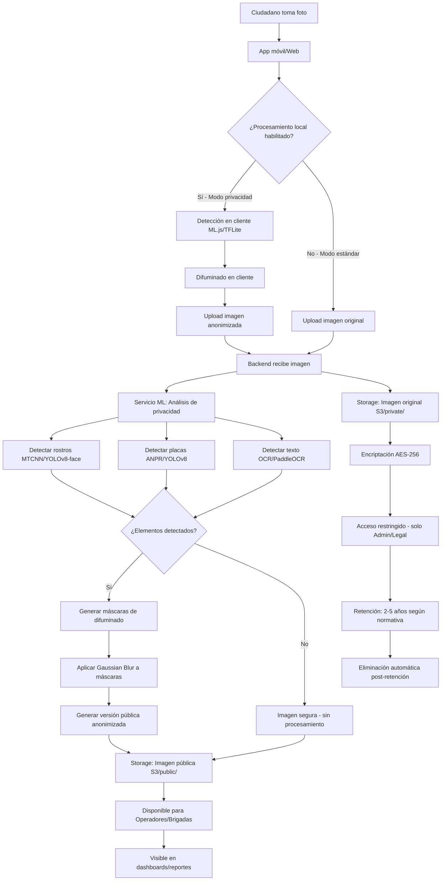

# R-08: Diseño del flujo de privacidad y anonimización

**Fecha:** 2026-01-13  
**Versión:** 1.0  
**Estado:** Completo

## Objetivo

Diseñar un pipeline completo de privacidad y anonimización para proteger datos sensibles en imágenes (rostros, placas vehiculares, información personal) y definir políticas de retención de datos que cumplan con normativas de protección de datos personales.

---

## 1. Visión general del sistema

### 1.1 Problemática

Los reportes ciudadanos contienen evidencias fotográficas que pueden incluir:

- ✅ **Datos útiles:** Daños en pavimento, señalización, alcantarillas, baches
- ⚠️**Datos sensibles:** Rostros de personas, placas vehiculares, números de casa, ventanas/interiores de propiedades privadas

**Riesgos:**
- Violación de privacidad individual
- Uso indebido de imágenes (publicación no autorizada)
- Responsabilidad legal del municipio
- Exposición de datos personales en reportes públicos

### 1.2 Objetivos del pipeline

1. **Detección automática** de elementos sensibles en imágenes
2. **Difuminado/ocultación** de datos sensibles antes de almacenamiento público
3. **Retención controlada** de imágenes originales (solo para auditoría legal)
4. **Anonimización** de metadatos y datos exportados
5. **Auditoría completa** de acceso a datos sensibles

---

## 2. Arquitectura del pipeline de privacidad

### 2.1 Diagrama de flujo completo



---

## 2.2 Componentes del sistema

### Cliente (Móvil/Web)

**Responsabilidad:** Procesamiento opcional en dispositivo (opt-in)

**Tecnologías:**
- **Web:** TensorFlow.js + face-api.js
- **Móvil:** TensorFlow Lite (Android/iOS)

**Flujo:**
1. Usuario activa "Modo privacidad" en configuración
2. Al tomar foto, modelo liviano detecta rostros/placas
3. Difumina en tiempo real antes de upload
4. Reduce riesgo de enviar datos sensibles al servidor

**Limitaciones:**
- Precisión menor que servidor (modelos comprimidos)
- Consumo de batería/CPU
- Requiere dispositivos modernos

---

### Backend API (FastAPI)

**Responsabilidad:** Coordinación, almacenamiento, auditoría

**Flujo:**
1. Recibe imagen (original o pre-anonimizada)
2. Almacena original en storage privado (encriptado)
3. Envía a servicio ML para análisis
4. Recibe imagen pública y metadatos de detecciones
5. Almacena versión pública
6. Registra evento en auditoría

**Endpoints:**

```python
POST /api/evidences/upload
- Multipart: image (file), report_id, metadata
- Headers: Authorization, X-Privacy-Mode (opt-in client processing)
- Response: {evidence_id, public_url, detections_count}

GET /api/evidences/{evidence_id}/original
- Requiere: ADMIN role + motivo legal
- Response: presigned URL temporal (15 min) + auditoría
- Uso: investigaciones legales, auditorías

GET /api/evidences/{evidence_id}/public
- Requiere: OPERATOR/BRIGADE role
- Response: presigned URL de imagen anonimizada
- Uso: operaciones normales
```

---

### Servicio ML de Privacidad

**Responsabilidad:** Detección y anonimización automática

**Ubicación:** Microservicio Python independiente o worker Celery

**Stack tecnológico:**

| Tarea | Tecnología | Descripción |
|-------|------------|-------------|
| Detección de rostros | **MTCNN** o **YOLOv8-face** | Precisión alta, bounding boxes |
| Detección de placas | **YOLOv8 custom** o **OpenALPR** | Entrenado en placas MX |
| OCR (texto sensible) | **PaddleOCR** o **EasyOCR** | Detectar números de casa, documentos |
| Difuminado | **OpenCV GaussianBlur** | Kernels adaptativos |
| Pixelado (alternativa) | **OpenCV resize + upscale** | Efecto mosaic |
| Gestión | **Celery + Redis** | Procesamiento asíncrono |

**Algoritmo de procesamiento:**

```python
# ml/privacy/anonymizer.py

import cv2
import numpy as np
from ultralytics import YOLO
from mtcnn import MTCNN

class PrivacyAnonymizer:
    def __init__(self):
        self.face_detector = MTCNN()
        self.plate_detector = YOLO('models/yolov8-plates-mx.pt')
        self.ocr = PaddleOCR(lang='es')
    
    async def process_image(self, image_path: str) -> dict:
        """
        Procesa imagen y genera versión anonimizada.
        
        Returns:
            {
                'anonymized_path': str,
                'detections': {
                    'faces': int,
                    'plates': int,
                    'text_regions': int
                },
                'privacy_score': float  # 0-1, mayor = más sensible
            }
        """
        img = cv2.imread(image_path)
        original_img = img.copy()
        
        # 1. Detectar rostros
        faces = self.face_detector.detect_faces(img)
        face_boxes = [face['box'] for face in faces]
        
        # 2. Detectar placas
        plate_results = self.plate_detector(img)
        plate_boxes = self._extract_boxes(plate_results)
        
        # 3. Detectar texto sensible (opcional)
        ocr_results = self.ocr.ocr(img)
        text_boxes = self._filter_sensitive_text(ocr_results)
        
        # 4. Aplicar difuminado
        for box in face_boxes + plate_boxes + text_boxes:
            img = self._apply_blur(img, box, kernel_size=51)
        
        # 5. Guardar versión anonimizada
        anonymized_path = image_path.replace('/private/', '/public/')
        cv2.imwrite(anonymized_path, img)
        
        # 6. Calcular privacy score
        total_detections = len(face_boxes) + len(plate_boxes) + len(text_boxes)
        privacy_score = min(1.0, total_detections * 0.15)  # 0.15 por elemento
        
        return {
            'anonymized_path': anonymized_path,
            'detections': {
                'faces': len(face_boxes),
                'plates': len(plate_boxes),
                'text_regions': len(text_boxes)
            },
            'privacy_score': privacy_score,
            'processing_time_ms': ...
        }
    
    def _apply_blur(self, img, box, kernel_size=31):
        """Aplica Gaussian Blur a región específica."""
        x, y, w, h = box
        
        # Expandir región un 10% para difuminar bordes
        padding = int(max(w, h) * 0.1)
        x1 = max(0, x - padding)
        y1 = max(0, y - padding)
        x2 = min(img.shape[1], x + w + padding)
        y2 = min(img.shape[0], y + h + padding)
        
        # Extraer ROI
        roi = img[y1:y2, x1:x2]
        
        # Aplicar blur (kernel adaptativo)
        blurred = cv2.GaussianBlur(roi, (kernel_size, kernel_size), 0)
        
        # Reemplazar en imagen original
        img[y1:y2, x1:x2] = blurred
        
        return img
    
    def _filter_sensitive_text(self, ocr_results):
        """Filtra textos que pueden ser sensibles (direcciones, teléfonos)."""
        import re
        
        sensitive_boxes = []
        phone_pattern = r'\d{10}'  # Teléfonos 10 dígitos
        address_pattern = r'#\d+'  # Números de casa
        
        for line in ocr_results:
            for word_info in line:
                text = word_info[1][0]
                
                if re.search(phone_pattern, text) or re.search(address_pattern, text):
                    box = word_info[0]  # Coordenadas del texto
                    sensitive_boxes.append(self._convert_polygon_to_box(box))
        
        return sensitive_boxes
```

---

## 3. Ubicación del procesamiento (dónde ocurre)

### 3.1 Matriz de decisión

| Criterio | Cliente | Backend API | Servicio ML |
|----------|---------|-------------|-------------|
| **Precisión** | ⭐⭐ (70-80%) | N/A (solo orquesta) | ⭐⭐⭐⭐⭐ (95%+) |
| **Privacidad** | ⭐⭐⭐⭐⭐ (no envía datos) | ⭐⭐⭐ | ⭐⭐⭐ |
| **Latencia** | ⭐⭐⭐ (1-3s local) | ⭐⭐⭐⭐ (inmediato) | ⭐⭐ (5-15s async) |
| **Costo CPU** | Usuario | Mínimo | Alto |
| **Escalabilidad** | ⭐⭐⭐⭐⭐ (distribuido) | ⭐⭐⭐⭐ | ⭐⭐ (requiere GPUs) |
| **Cumplimiento legal** | ⭐⭐⭐⭐ (datos no salen) | ⭐⭐⭐⭐ (auditoría) | ⭐⭐⭐⭐ (auditoría) |

---

### 3.2 Estrategia híbrida (RECOMENDADO)

**MVP:**
1. **Cliente:** Opcional (feature flag)
   - Usuario puede activar "Modo privacidad"
   - Detección básica con TFLite (solo rostros)
   - Difumina antes de enviar al servidor

2. **Servicio ML:** Obligatorio (siempre)
   - Procesa todas las imágenes (incluso pre-anonimizadas)
   - Doble verificación de seguridad
   - Genera versión pública definitiva

**Flujo híbrido:**
```
Usuario toma foto
  ↓
[Opcional] Procesamiento en cliente (si activado)
  ↓
Upload al backend
  ↓
Almacenamiento original (privado, encriptado)
  ↓
Servicio ML: Análisis completo (OBLIGATORIO)
  ↓
Generación de versión pública anonimizada
  ↓
Distribución a operadores/brigadas
```

**Ventajas:**
- ✅ Privacidad desde origen (cliente)
- ✅ Precisión garantizada (servidor)
- ✅ Auditoría completa (backend registra todo)
- ✅ Flexibilidad (usuarios deciden nivel de privacidad)

---

## 4. Almacenamiento y encriptación

### 4.1 Arquitectura de storage

```
s3://sirccd-evidences/
├── private/                          # Imágenes originales
│   ├── 2026/01/13/
│   │   ├── report-uuid-1-original.jpg.encrypted
│   │   ├── report-uuid-2-original.jpg.encrypted
│   │   └── metadata/
│   │       ├── report-uuid-1.json    # Detecciones, privacy_score
│   │       └── report-uuid-2.json
│   └── [Acceso: Solo ADMIN + auditoría]
│
├── public/                           # Imágenes anonimizadas
│   ├── 2026/01/13/
│   │   ├── report-uuid-1-public.jpg
│   │   ├── report-uuid-2-public.jpg
│   │   └── thumbnails/               # Versiones optimizadas
│   │       ├── report-uuid-1-thumb.jpg
│   │       └── report-uuid-2-thumb.jpg
│   └── [Acceso: OPERATOR, BRIGADE, ADMIN]
│
└── archived/                         # Post-retención
    └── 2024/                         # Comprimidos para análisis histórico
        └── anonymized-dataset-2024-q1.tar.gz
```

---

### 4.2 Encriptación de imágenes originales

**Método:** AES-256-GCM (Galois/Counter Mode)

**Implementación:**

```python
# backend/core/encryption.py

from cryptography.hazmat.primitives.ciphers.aead import AESGCM
from cryptography.hazmat.backends import default_backend
import os
import base64

class ImageEncryption:
    def __init__(self, master_key: bytes):
        """
        master_key: 32 bytes (256 bits) desde AWS KMS o vault seguro
        """
        self.cipher = AESGCM(master_key)
    
    def encrypt_file(self, input_path: str, output_path: str) -> dict:
        """Encripta archivo de imagen."""
        
        # Leer imagen original
        with open(input_path, 'rb') as f:
            plaintext = f.read()
        
        # Generar nonce aleatorio (96 bits)
        nonce = os.urandom(12)
        
        # Encriptar
        ciphertext = self.cipher.encrypt(nonce, plaintext, None)
        
        # Guardar: nonce (12 bytes) + ciphertext
        with open(output_path, 'wb') as f:
            f.write(nonce + ciphertext)
        
        return {
            'encrypted_path': output_path,
            'nonce_b64': base64.b64encode(nonce).decode(),
            'size_bytes': len(ciphertext)
        }
    
    def decrypt_file(self, encrypted_path: str, output_path: str):
        """Desencripta archivo (solo para acceso autorizado)."""
        
        with open(encrypted_path, 'rb') as f:
            data = f.read()
        
        # Separar nonce y ciphertext
        nonce = data[:12]
        ciphertext = data[12:]
        
        # Desencriptar
        plaintext = self.cipher.decrypt(nonce, ciphertext, None)
        
        # Guardar temporal
        with open(output_path, 'wb') as f:
            f.write(plaintext)
        
        return output_path

# Uso en API
@app.get("/api/evidences/{evidence_id}/original")
@require_permission(Permission.EVIDENCE_VIEW_ORIGINAL)
async def get_original_evidence(
    evidence_id: str,
    reason: str,  # Motivo legal obligatorio
    current_user: User = Depends(get_current_user)
):
    # Auditar acceso
    await audit_log.record(
        user_id=current_user.id,
        action='evidence:access_original',
        resource_id=evidence_id,
        reason=reason,
        ip_address=request.client.host
    )
    
    # Desencriptar temporalmente
    evidence = await db.get_evidence(evidence_id)
    encrypted_path = evidence.original_encrypted_path
    
    temp_path = f"/tmp/{evidence_id}-temp.jpg"
    encryptor.decrypt_file(encrypted_path, temp_path)
    
    # Generar presigned URL temporal (15 minutos)
    presigned_url = s3_client.generate_presigned_url(
        'get_object',
        Params={'Bucket': 'private', 'Key': temp_path},
        ExpiresIn=900  # 15 min
    )
    
    # Programar eliminación del archivo temporal
    schedule_file_deletion(temp_path, delay_seconds=1800)
    
    return {
        'url': presigned_url,
        'expires_in': 900,
        'warning': 'Acceso auditado - solo uso autorizado'
    }
```

---

### 4.3 Gestión de claves (KMS)

**Opciones:**

| Opción | Pros | Contras | Costo |
|--------|------|---------|-------|
| **AWS KMS** | Gestión automática, auditoría | Vendor lock-in | ~$1/mes/clave |
| **HashiCorp Vault** | Open source, multi-cloud | Requiere infraestructura | Self-hosted |
| **Azure Key Vault** | Integración con Azure | Vendor lock-in | ~$0.03/10k ops |
| **Google Cloud KMS** | Global, baja latencia | Vendor lock-in | ~$0.06/clave/mes |

**Recomendación MVP:** AWS KMS con rotación automática anual

**Configuración:**
```python
import boto3

kms_client = boto3.client('kms', region_name='us-east-1')

# Crear clave maestra
response = kms_client.create_key(
    Description='SIRCCD Evidence Encryption Master Key',
    KeyUsage='ENCRYPT_DECRYPT',
    Origin='AWS_KMS',
    MultiRegion=False,
    Tags=[
        {'TagKey': 'Project', 'TagValue': 'SIRCCD'},
        {'TagKey': 'Environment', 'TagValue': 'Production'}
    ]
)

key_id = response['KeyMetadata']['KeyId']

# Habilitar rotación automática
kms_client.enable_key_rotation(KeyId=key_id)
```

---

## 5. Reglas de retención de datos

### 5.1 Política de retención por tipo

| Tipo de dato | Retención | Formato | Acceso | Eliminación |
|--------------|-----------|---------|--------|-------------|
| **Imagen original (privada)** | 2 años | Encriptada (AES-256) | Solo Admin + motivo legal | Automática post-retención |
| **Imagen pública (anonimizada)** | 5 años | No encriptada | Operadores, Brigadas | Archivado después de cierre |
| **Metadatos de detecciones** | 5 años | JSON en DB | Admin, análisis | Incluido en exportaciones |
| **Logs de auditoría** | 7 años | Logs estructurados | Admin | Archivado a cold storage |
| **Reportes cerrados** | 5 años | Base de datos | Todos (según RBAC) | Soft delete → hard delete |
| **Reportes rechazados/spam** | 6 meses | Base de datos | Operadores | Eliminación automática |
| **Datos exportados** | N/A | Anonimizados | Según aprobación | Responsabilidad del receptor |

---

### 5.2 Timeline de retención (ejemplo)

```
Día 0: Reporte creado
  ├── Original: Encriptado en S3 private/
  └── Pública: Disponible en S3 public/

Día 10: Reporte cerrado
  ├── Original: Mantiene retención (2 años desde creación)
  └── Pública: Disponible para consulta histórica

Año 2 (730 días): Fin de retención de original
  ├── Original: Eliminación automática
  │   └── Job nocturno verifica fecha de creación
  └── Pública: Se mantiene (hasta 5 años)

Año 5 (1825 días): Fin de retención de pública
  ├── Pública: Archivado a dataset histórico
  │   └── Compresión: tar.gz con anonimización extra
  └── Metadatos: Mantienen en DB (soft delete)

Año 7: Eliminación de logs de auditoría
  └── Migración a cold storage o eliminación final
```

---

### 5.3 Implementación: Jobs de limpieza

**Cron job diario (3:00 AM):**

```python
# backend/jobs/data_retention.py

from datetime import datetime, timedelta
from sqlalchemy import and_

class DataRetentionJob:
    async def cleanup_expired_data(self):
        """Job nocturno de limpieza según políticas de retención."""
        
        now = datetime.utcnow()
        
        # 1. Eliminar imágenes originales > 2 años
        cutoff_original = now - timedelta(days=730)
        
        expired_originals = await db.query(Evidence).filter(
            and_(
                Evidence.created_at < cutoff_original,
                Evidence.original_encrypted_path.isnot(None),
                Evidence.deleted_at.is_(None)
            )
        ).all()
        
        for evidence in expired_originals:
            # Eliminar archivo de S3
            s3_client.delete_object(
                Bucket='private',
                Key=evidence.original_encrypted_path
            )
            
            # Marcar como eliminado en DB
            evidence.original_encrypted_path = None
            evidence.original_deleted_at = now
            
            # Auditar eliminación
            await audit_log.record(
                action='evidence:auto_delete_original',
                resource_id=evidence.id,
                reason='Retención de 2 años cumplida',
                automated=True
            )
        
        await db.commit()
        print(f"Eliminados {len(expired_originals)} originales expirados")
        
        # 2. Archivar imágenes públicas > 5 años
        cutoff_public = now - timedelta(days=1825)
        
        expired_publics = await db.query(Evidence).filter(
            and_(
                Evidence.created_at < cutoff_public,
                Evidence.public_path.isnot(None),
                Evidence.archived_at.is_(None)
            )
        ).all()
        
        # Crear archivo comprimido trimestral
        if expired_publics:
            archive_path = self._create_archive(expired_publics, now)
            
            for evidence in expired_publics:
                evidence.archived_at = now
                evidence.archive_location = archive_path
        
        await db.commit()
        print(f"Archivados {len(expired_publics)} imágenes públicas")
        
        # 3. Eliminar reportes rechazados > 6 meses
        cutoff_rejected = now - timedelta(days=180)
        
        rejected_reports = await db.query(Report).filter(
            and_(
                Report.status.in_(['REJECTED', 'SPAM', 'DUPLICATE']),
                Report.created_at < cutoff_rejected,
                Report.deleted_at.is_(None)
            )
        ).all()
        
        for report in rejected_reports:
            # Soft delete
            report.deleted_at = now
            
            # Eliminar evidencias asociadas
            for evidence in report.evidences:
                s3_client.delete_object(Bucket='public', Key=evidence.public_path)
                if evidence.original_encrypted_path:
                    s3_client.delete_object(Bucket='private', Key=evidence.original_encrypted_path)
        
        await db.commit()
        print(f"Eliminados {len(rejected_reports)} reportes rechazados")
        
        # 4. Mover logs de auditoría > 7 años a cold storage
        cutoff_logs = now - timedelta(days=2555)
        
        old_logs = await db.query(AuditLog).filter(
            AuditLog.timestamp < cutoff_logs
        ).all()
        
        if old_logs:
            # Exportar a S3 Glacier
            log_archive = self._export_logs_to_glacier(old_logs, now)
            
            # Eliminar de DB activa
            await db.query(AuditLog).filter(
                AuditLog.timestamp < cutoff_logs
            ).delete()
        
        await db.commit()
        print(f"Archivados {len(old_logs)} logs a cold storage")
    
    def _create_archive(self, evidences, timestamp):
        """Crea archivo tar.gz con imágenes públicas."""
        import tarfile
        
        quarter = (timestamp.month - 1) // 3 + 1
        archive_name = f"anonymized-dataset-{timestamp.year}-q{quarter}.tar.gz"
        archive_path = f"s3://sirccd-evidences/archived/{timestamp.year}/{archive_name}"
        
        with tarfile.open(f"/tmp/{archive_name}", "w:gz") as tar:
            for evidence in evidences:
                # Descargar de S3 public
                local_path = f"/tmp/{evidence.id}.jpg"
                s3_client.download_file('public', evidence.public_path, local_path)
                
                # Agregar a archivo
                tar.add(local_path, arcname=f"{evidence.id}.jpg")
                os.remove(local_path)
        
        # Upload a S3 archived
        s3_client.upload_file(f"/tmp/{archive_name}", 'archived', archive_name)
        os.remove(f"/tmp/{archive_name}")
        
        return archive_path
```

**Configuración cron (backend/Dockerfile o k8s CronJob):**

```yaml
# infra/k8s/cronjobs/data-retention.yaml
apiVersion: batch/v1
kind: CronJob
metadata:
  name: data-retention-cleanup
spec:
  schedule: "0 3 * * *"  # Diario a las 3:00 AM
  jobTemplate:
    spec:
      template:
        spec:
          containers:
          - name: cleanup
            image: sirccd-backend:latest
            command: ["python", "-m", "backend.jobs.data_retention"]
            env:
            - name: DATABASE_URL
              valueFrom:
                secretKeyRef:
                  name: db-credentials
                  key: url
          restartPolicy: OnFailure
```

---

## 6. Auditoría de acceso a datos sensibles

### 6.1 Eventos auditables

Todos los accesos a datos sensibles generan logs inmutables:

| Evento | Datos registrados | Retención |
|--------|-------------------|-----------|
| Acceso a imagen original | user_id, evidence_id, motivo, IP, timestamp | 7 años |
| Descarga de exportación con datos personales | user_id, filtros, cantidad registros, IP | 7 años |
| Modificación de políticas de retención | user_id, política anterior/nueva, fecha efectiva | Permanente |
| Desencriptación de evidencia | user_id, evidence_id, motivo legal, duración acceso | 7 años |
| Fallo de anonimización (error ML) | evidence_id, tipo error, imagen bloqueada | Permanente |

---

### 6.2 Dashboard de auditoría (solo Admin)

**Métricas clave:**

```sql
-- Accesos a imágenes originales (últimos 30 días)
SELECT 
    u.email,
    COUNT(*) as accesos_totales,
    COUNT(DISTINCT al.resource_id) as evidencias_unicas,
    MAX(al.timestamp) as ultimo_acceso
FROM audit_log al
JOIN user_account u ON al.user_id = u.id
WHERE al.action = 'evidence:access_original'
  AND al.timestamp > NOW() - INTERVAL '30 days'
GROUP BY u.id, u.email
ORDER BY accesos_totales DESC;

-- Evidencias más accedidas (posible sobre-uso)
SELECT 
    e.id,
    e.report_id,
    COUNT(*) as accesos,
    ARRAY_AGG(DISTINCT u.email) as usuarios
FROM audit_log al
JOIN evidence e ON al.resource_id = e.id
JOIN user_account u ON al.user_id = u.id
WHERE al.action = 'evidence:access_original'
  AND al.timestamp > NOW() - INTERVAL '90 days'
GROUP BY e.id, e.report_id
HAVING COUNT(*) > 5  -- Umbral de sospecha
ORDER BY accesos DESC;
```

**Alertas automáticas:**

```python
# backend/services/audit_alerts.py

async def check_suspicious_access_patterns():
    """Detecta patrones sospechosos de acceso a datos sensibles."""
    
    # 1. Usuario accede a >10 imágenes originales en 1 hora
    recent_accesses = await db.execute("""
        SELECT user_id, COUNT(*) as count
        FROM audit_log
        WHERE action = 'evidence:access_original'
          AND timestamp > NOW() - INTERVAL '1 hour'
        GROUP BY user_id
        HAVING COUNT(*) > 10
    """)
    
    for row in recent_accesses:
        await send_alert(
            severity='HIGH',
            message=f"Usuario {row.user_id} accedió a {row.count} imágenes originales en 1 hora",
            action_required='Revisar motivos de acceso en auditoría'
        )
    
    # 2. Acceso sin motivo legal especificado
    missing_reason = await db.query(AuditLog).filter(
        and_(
            AuditLog.action == 'evidence:access_original',
            AuditLog.reason.is_(None),
            AuditLog.timestamp > datetime.utcnow() - timedelta(hours=24)
        )
    ).all()
    
    if missing_reason:
        await send_alert(
            severity='CRITICAL',
            message=f"{len(missing_reason)} accesos sin motivo legal registrado",
            action_required='Contactar usuarios para justificación retroactiva'
        )
```

---

## 7. Anonimización de datos exportados

### 7.1 Niveles de anonimización

| Nivel | Descripción | Uso |
|-------|-------------|-----|
| **0 - Sin anonimización** | Datos completos (incluye IDs reales, coordenadas exactas) | Solo Admin con aprobación |
| **1 - Básica** | IDs hasheados, coordenadas truncadas (3 decimales ≈ 111m) | Análisis interno operadores |
| **2 - Media** | Fechas agregadas por mes, sin datos de usuario, zonas generales | Reportes públicos municipales |
| **3 - Alta** | Datos agregados, sin IDs, solo estadísticas | Publicación abierta / investigación |

---

### 7.2 Pipeline de exportación

```python
# backend/services/export_service.py

class DataExporter:
    async def export_reports(
        self,
        filters: dict,
        anonymization_level: int,
        user: User
    ) -> str:
        """
        Exporta reportes con nivel de anonimización especificado.
        
        Args:
            filters: Filtros de consulta (fechas, zonas, categorías)
            anonymization_level: 0-3 (mayor = más anónimo)
            user: Usuario que solicita exportación
        
        Returns:
            URL de descarga del archivo CSV/JSON
        """
        
        # Validar permisos
        if anonymization_level == 0 and user.role != UserRole.ADMIN:
            raise PermissionDenied("Solo Admin puede exportar sin anonimización")
        
        # Obtener reportes
        reports = await self._get_filtered_reports(filters, user)
        
        # Aplicar anonimización
        anonymized_data = []
        
        for report in reports:
            if anonymization_level == 0:
                # Datos completos
                data = {
                    'id': report.id,
                    'user_id': report.user_id,
                    'location': {
                        'lat': report.latitude,
                        'lng': report.longitude
                    },
                    'created_at': report.created_at.isoformat(),
                    'category': report.category,
                    'status': report.status,
                    'description': report.description
                }
            
            elif anonymization_level == 1:
                # IDs hasheados, coordenadas truncadas
                data = {
                    'id': hashlib.sha256(report.id.encode()).hexdigest()[:16],
                    'user_id': hashlib.sha256(report.user_id.encode()).hexdigest()[:16],
                    'location': {
                        'lat': round(report.latitude, 3),  # ±111m precisión
                        'lng': round(report.longitude, 3)
                    },
                    'created_at': report.created_at.isoformat(),
                    'category': report.category,
                    'status': report.status,
                    'description': self._sanitize_text(report.description)
                }
            
            elif anonymization_level == 2:
                # Fechas agregadas, sin IDs de usuario
                data = {
                    'report_id': hashlib.sha256(report.id.encode()).hexdigest()[:12],
                    'zone': self._get_zone_name(report.latitude, report.longitude),
                    'created_month': report.created_at.strftime('%Y-%m'),
                    'category': report.category,
                    'status': report.status,
                    'resolution_days': (report.closed_at - report.created_at).days if report.closed_at else None
                }
            
            else:  # Level 3 - Alta
                # Solo estadísticas agregadas (sin filas individuales)
                # Se calcula al final como resumen
                continue
            
            anonymized_data.append(data)
        
        # Level 3: Retornar solo agregados
        if anonymization_level == 3:
            anonymized_data = self._aggregate_statistics(reports)
        
        # Generar archivo
        export_file = await self._create_export_file(anonymized_data, format='csv')
        
        # Auditar exportación
        await audit_log.record(
            user_id=user.id,
            action='data:export',
            metadata={
                'filters': filters,
                'anonymization_level': anonymization_level,
                'record_count': len(anonymized_data)
            }
        )
        
        return export_file
    
    def _sanitize_text(self, text: str) -> str:
        """Elimina información personal de texto libre."""
        import re
        
        # Eliminar teléfonos
        text = re.sub(r'\d{10}', '[TELÉFONO]', text)
        
        # Eliminar emails
        text = re.sub(r'[\w\.-]+@[\w\.-]+\.\w+', '[EMAIL]', text)
        
        # Eliminar nombres propios (básico)
        # TODO: Usar NER (Named Entity Recognition) para mejor precisión
        
        return text
    
    def _aggregate_statistics(self, reports):
        """Genera estadísticas agregadas para nivel 3."""
        from collections import Counter
        
        return {
            'total_reports': len(reports),
            'by_category': dict(Counter(r.category for r in reports)),
            'by_status': dict(Counter(r.status for r in reports)),
            'avg_resolution_days': np.mean([
                (r.closed_at - r.created_at).days 
                for r in reports if r.closed_at
            ]),
            'time_period': {
                'start': min(r.created_at for r in reports).date().isoformat(),
                'end': max(r.created_at for r in reports).date().isoformat()
            }
        }
```

---

## 8. Cumplimiento normativo

### 8.1 Marco legal mexicano

| Normativa | Aplicabilidad | Requisitos clave |
|-----------|---------------|------------------|
| **LFPDPPP** (Ley Federal de Protección de Datos Personales) | ✅ Aplica | Consentimiento, finalidad, proporcionalidad |
| **INAI** (Instituto Nacional de Transparencia) | ✅ Aplica | Derecho de acceso, rectificación, cancelación |
| **Ley General de Transparencia** | ✅ Aplica | Datos públicos vs sensibles, clasificación |
| **NOM-151-SCFI-2016** | ⚠️ Opcional (recomendado) | Seguridad de datos personales en sistemas |

---

### 8.2 Derechos ARCO (Acceso, Rectificación, Cancelación, Oposición)

**Implementación en SIRCCD:**

```python
# backend/api/arco.py

@app.post("/api/arco/request")
async def submit_arco_request(
    request_type: str,  # 'access', 'rectify', 'cancel', 'oppose'
    user_id: str,
    details: str,
    identity_proof: UploadFile
):
    """
    Endpoint para solicitudes ARCO (derechos de datos personales).
    
    Proceso:
    1. Usuario envía solicitud con prueba de identidad
    2. Admin revisa en 20 días hábiles (plazo legal)
    3. Se ejecuta acción solicitada
    4. Usuario recibe confirmación
    """
    
    arco_request = ARCORequest(
        user_id=user_id,
        request_type=request_type,
        details=details,
        status='PENDING',
        submitted_at=datetime.utcnow()
    )
    
    await db.session.add(arco_request)
    await db.session.commit()
    
    # Notificar a Admin
    await notify_admin(
        subject='Nueva solicitud ARCO',
        message=f"Usuario {user_id} solicita {request_type}",
        urgency='MEDIUM'
    )
    
    return {
        'request_id': arco_request.id,
        'estimated_response': '20 días hábiles',
        'status': 'PENDING'
    }

@app.post("/api/arco/{request_id}/process")
@require_role(UserRole.ADMIN)
async def process_arco_request(request_id: str, action: str):
    """Admin procesa solicitud ARCO."""
    
    arco = await db.get_arco_request(request_id)
    
    if arco.request_type == 'access':
        # Generar reporte con todos los datos del usuario
        user_data = await export_user_data(arco.user_id)
        await send_email(arco.user.email, user_data)
    
    elif arco.request_type == 'cancel':
        # Eliminar todos los datos personales (derecho al olvido)
        await anonymize_user_data(arco.user_id)
        await deactivate_user(arco.user_id)
    
    arco.status = 'COMPLETED'
    arco.completed_at = datetime.utcnow()
    await db.commit()
```

---

### 8.3 Aviso de privacidad

**Contenido mínimo:**

```markdown
# Aviso de Privacidad - SIRCCD

## Responsable
[Nombre del Municipio]
Dirección: [...]
Email: privacidad@municipio.gob.mx

## Finalidad del tratamiento
Los datos personales (nombre, email, ubicación GPS, fotografías) se utilizan para:
- Registro y atención de reportes de daños viales
- Comunicación sobre el estado del reporte
- Análisis estadístico para mejora del servicio

## Datos sensibles
- **Fotografías:** Pueden contener rostros o placas. Se aplica anonimización automática.
- **Ubicación GPS:** Se utiliza para georreferenciar daños. Precisión reducida en reportes públicos.

## Transferencias
No se comparten datos con terceros excepto:
- Brigadas municipales asignadas (solo datos del reporte)
- Autoridades legales (con orden judicial)

## Derechos ARCO
Puedes ejercer tus derechos de Acceso, Rectificación, Cancelación u Oposición enviando solicitud a: arco@municipio.gob.mx

## Retención
- Imágenes originales: 2 años
- Imágenes anonimizadas: 5 años
- Reportes: 5 años desde cierre

## Consentimiento
Al usar SIRCCD, consientes el tratamiento de tus datos según este aviso.

Fecha última actualización: 2026-01-13
```

**Ubicación:**
- App móvil: Pantalla obligatoria al primer registro
- Web: Footer con link a página completa
- API: Header `X-Privacy-Policy-URL` en respuestas

---

## 9. Casos edge y manejo de errores

### 9.1 Fallo en detección/anonimización

**Problema:** Servicio ML no detecta rostro visible (falso negativo)

**Solución:**

```python
# ml/privacy/quality_check.py

class PrivacyQualityCheck:
    async def validate_anonymization(
        self,
        original_path: str,
        anonymized_path: str,
        detections: dict
    ) -> dict:
        """
        Verificación de calidad de anonimización.
        
        Returns:
            {
                'passed': bool,
                'confidence': float,
                'issues': list
            }
        """
        
        issues = []
        
        # 1. Comparar histogramas (imágenes muy similares = posible fallo)
        similarity = self._compare_histograms(original_path, anonymized_path)
        
        if similarity > 0.95 and detections['faces'] > 0:
            issues.append('HIGH_SIMILARITY_WITH_FACES_DETECTED')
        
        # 2. Detectar bordes en imagen anonimizada (rostros tienen bordes)
        edges_detected = self._detect_face_like_edges(anonymized_path)
        
        if edges_detected > 0:
            issues.append('POSSIBLE_UNBLURRED_FACES')
        
        # 3. Verificar que máscaras cubran detecciones
        if detections['faces'] == 0 and detections['plates'] == 0:
            # Imagen "segura" pero verificar con modelo secundario
            secondary_check = await self._run_secondary_detector(original_path)
            
            if secondary_check['faces'] > 0:
                issues.append('FALSE_NEGATIVE_PRIMARY_DETECTOR')
        
        passed = len(issues) == 0
        confidence = 1.0 - (len(issues) * 0.2)
        
        return {
            'passed': passed,
            'confidence': confidence,
            'issues': issues
        }

# Uso en pipeline
anonymized = await anonymizer.process_image(image_path)
validation = await quality_check.validate_anonymization(
    image_path,
    anonymized['anonymized_path'],
    anonymized['detections']
)

if not validation['passed']:
    # Bloquear imagen hasta revisión manual
    evidence.status = 'BLOCKED_PRIVACY_ISSUE'
    evidence.privacy_issues = validation['issues']
    
    # Notificar a Admin
    await notify_admin(
        severity='HIGH',
        message=f"Evidencia {evidence.id} bloqueada por fallo de anonimización",
        issues=validation['issues']
    )
    
    # NO publicar imagen
    raise PrivacyException("Anonimización no confiable")
```

---

### 9.2 Usuario solicita imagen sin difuminar

**Escenario:** Ciudadano quiere ver su foto original (sin blur) para verificar calidad

**Solución:**

```python
@app.get("/api/evidences/{evidence_id}/preview-original")
async def preview_original_evidence(
    evidence_id: str,
    current_user: User = Depends(get_current_user)
):
    """
    Permite al PROPIETARIO ver su imagen original brevemente.
    
    Restricciones:
    - Solo el usuario que subió la imagen
    - Watermark con "SOLO PARA VERIFICACIÓN"
    - Expiración 5 minutos
    - Máximo 3 veces por evidencia
    """
    evidence = await db.get_evidence(evidence_id)
    
    # Verificar ownership
    if evidence.report.user_id != current_user.id:
        raise HTTPException(403, "Solo el propietario puede ver original")
    
    # Verificar límite de accesos
    access_count = await db.count_preview_accesses(evidence_id, current_user.id)
    
    if access_count >= 3:
        raise HTTPException(429, "Límite de previsualizaciones alcanzado (máx 3)")
    
    # Desencriptar y agregar watermark
    temp_path = await decryptor.decrypt_file(evidence.original_encrypted_path)
    watermarked_path = add_watermark(
        temp_path,
        text="SOLO VERIFICACIÓN - NO COMPARTIR",
        opacity=0.7
    )
    
    # Generar URL temporal (5 min)
    url = generate_presigned_url(watermarked_path, expires_in=300)
    
    # Auditar acceso
    await audit_log.record(
        user_id=current_user.id,
        action='evidence:preview_original',
        resource_id=evidence_id,
        reason='Verificación de calidad por propietario'
    )
    
    return {
        'url': url,
        'expires_in': 300,
        'remaining_previews': 3 - access_count - 1
    }
```

---

## 10. Métricas y monitoreo

### 10.1 KPIs del sistema de privacidad

```python
# Dashboards de privacidad (solo Admin)

# 1. Tasa de anonimización exitosa
SELECT 
    DATE(created_at) as date,
    COUNT(*) as total_images,
    COUNT(*) FILTER (WHERE privacy_score > 0) as images_with_detections,
    COUNT(*) FILTER (WHERE status = 'BLOCKED_PRIVACY_ISSUE') as blocked_images,
    ROUND(AVG(privacy_score), 2) as avg_privacy_score
FROM evidence
WHERE created_at > NOW() - INTERVAL '30 days'
GROUP BY DATE(created_at)
ORDER BY date DESC;

# 2. Tiempo promedio de procesamiento
SELECT 
    AVG(processing_time_ms) as avg_processing_ms,
    PERCENTILE_CONT(0.95) WITHIN GROUP (ORDER BY processing_time_ms) as p95_ms,
    MAX(processing_time_ms) as max_ms
FROM ml_processing_log
WHERE task_type = 'privacy_anonymization'
  AND created_at > NOW() - INTERVAL '7 days';

# 3. Accesos a imágenes originales (posible anomalía)
SELECT 
    u.email,
    u.role,
    COUNT(*) as accesses,
    MAX(al.timestamp) as last_access
FROM audit_log al
JOIN user_account u ON al.user_id = u.id
WHERE al.action = 'evidence:access_original'
  AND al.timestamp > NOW() - INTERVAL '7 days'
GROUP BY u.id, u.email, u.role
ORDER BY accesses DESC
LIMIT 10;
```

---

### 10.2 Alertas de privacidad

```yaml
# infra/monitoring/privacy-alerts.yaml

alerts:
  - name: high_privacy_score_spike
    condition: AVG(evidence.privacy_score) > 0.5 OVER 1h
    severity: WARNING
    action: Posible aumento de fotos sensibles - revisar calidad de reportes
  
  - name: anonymization_failures
    condition: COUNT(evidence WHERE status='BLOCKED_PRIVACY_ISSUE') > 5 OVER 10m
    severity: CRITICAL
    action: Fallo en servicio ML - detener uploads hasta resolución
  
  - name: suspicious_original_access
    condition: COUNT(audit_log WHERE action='evidence:access_original' BY user_id) > 10 OVER 1h
    severity: HIGH
    action: Usuario accediendo masivamente a originales - posible abuso
  
  - name: retention_job_failed
    condition: data_retention_job.last_run > 36h ago
    severity: HIGH
    action: Job de limpieza no ejecutado - verificar cronjob
```

---

## 11. Roadmap de implementación

### Fase 1: MVP (Mes 1-2)

- [x] Definir arquitectura de almacenamiento (private/public)
- [ ] Implementar servicio ML básico (solo rostros con MTCNN)
- [ ] Encriptación AES-256 de imágenes originales
- [ ] API de evidencias con URLs firmadas
- [ ] Auditoría básica de accesos
- [ ] Job de retención (solo eliminación de originales >2 años)

### Fase 2: Mejoras (Mes 3-4)

- [ ] Detección de placas vehiculares (YOLOv8 custom)
- [ ] Procesamiento opcional en cliente (TFLite móvil)
- [ ] Dashboard de auditoría para Admin
- [ ] Alertas automáticas de accesos sospechosos
- [ ] Exportaciones con niveles de anonimización

### Fase 3: Avanzado (Mes 5-6)

- [ ] OCR para detectar texto sensible (PaddleOCR)
- [ ] Verificación de calidad de anonimización (doble modelo)
- [ ] NER para sanitización de texto libre
- [ ] Políticas de retención granulares (por categoría/zona)
- [ ] Cumplimiento ARCO automatizado

### Fase 4: Optimización (Post-MVP)

- [ ] Modelos ML optimizados (ONNX Runtime, TensorRT)
- [ ] Cache de resultados de anonimización
- [ ] Compresión inteligente de imágenes archivadas
- [ ] Integración con KMS multi-región
- [ ] Certificación NOM-151-SCFI-2016

---

## 12. Costos estimados

| Componente | Costo mensual (1000 reportes/mes) | Notas |
|------------|-----------------------------------|-------|
| **S3 Storage** | $15-30 | 5GB private + 10GB public |
| **AWS KMS** | $1-3 | 1 clave maestra + operaciones |
| **GPU para ML** (g4dn.xlarge) | $120-180 | 4-6h/día procesamiento async |
| **Transferencia datos** | $5-10 | Download de imágenes |
| **CloudWatch Logs** | $3-5 | Auditoría y monitoreo |
| **Total MVP** | **$144-228/mes** | Escala con volumen |

**Optimizaciones:**
- Usar CPU para detección (más lento pero más barato)
- Spot instances para workers ML (-70% costo GPU)
- S3 Intelligent-Tiering para archivado automático

---

## 13. Resumen ejecutivo

| Aspecto | Decisión |
|---------|----------|
| **Procesamiento principal** | Servicio ML en backend (obligatorio) |
| **Procesamiento cliente** | Opcional (opt-in para usuarios conscientes de privacidad) |
| **Detección rostros** | MTCNN (MVP) → YOLOv8-face (futuro) |
| **Detección placas** | YOLOv8 custom entrenado en placas MX |
| **Difuminado** | Gaussian Blur adaptativo (kernel 31-51px) |
| **Almacenamiento original** | S3 private/ encriptado AES-256 + KMS |
| **Almacenamiento público** | S3 public/ sin encriptar (ya anonimizado) |
| **Retención original** | 2 años → eliminación automática |
| **Retención pública** | 5 años → archivado comprimido |
| **Auditoría accesos** | 100% de accesos a originales |
| **Exportaciones** | 4 niveles de anonimización (0-3) |
| **Cumplimiento legal** | LFPDPPP + derechos ARCO |
| **Costo estimado MVP** | $144-228/mes (1000 reportes) |

---

## Referencias

- [MTCNN Face Detection](https://github.com/ipazc/mtcnn)
- [YOLOv8 Documentation](https://docs.ultralytics.com/)
- [PaddleOCR](https://github.com/PaddlePaddle/PaddleOCR)
- [OpenCV Anonymization Techniques](https://pyimagesearch.com/2020/04/06/blur-and-anonymize-faces-with-opencv-and-python/)
- [AWS KMS Best Practices](https://docs.aws.amazon.com/kms/latest/developerguide/best-practices.html)
- [INAI - Derechos ARCO](https://home.inai.org.mx/)
- [LFPDPPP - Ley Federal](http://www.diputados.gob.mx/LeyesBiblio/pdf/LFPDPPP.pdf)

---

**Documento aprobado para implementación**  
**Próximo paso:** Implementar servicio ML de anonimización y encriptación de storage
