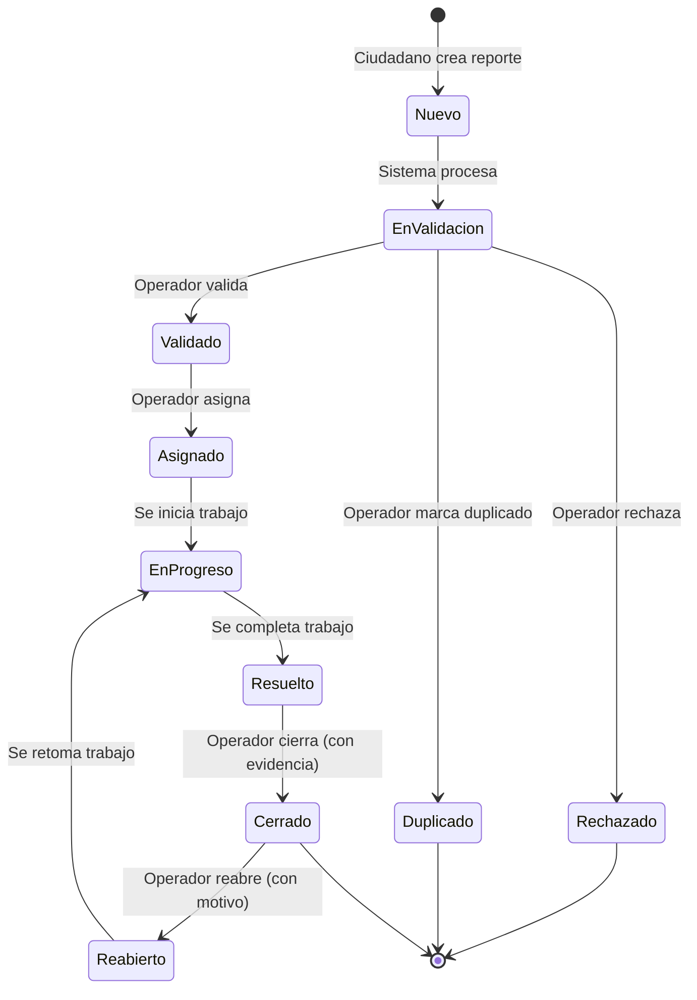

# R-03: Definir roles y permisos (RBAC)

**Fecha:** 2026-01-13  
**Versión:** 1.0  
**Estado:** Completo

## Objetivo

Definir un esquema de control de acceso basado en roles (RBAC) para el sistema SIRCCD, especificando roles, permisos, visibilidad de datos y reglas de seguridad para proteger reportes, evidencias, métricas y configuración.

---

## 1. Roles principales

### 1.1 Ciudadano (CITIZEN)

**Descripción:** Usuario que crea reportes de daños viales y consulta el estado de los suyos.

**Responsabilidades:**
- Crear reportes con ubicación, descripción, categoría y evidencia fotográfica
- Consultar estado y progreso de reportes propios
- Aportar evidencia adicional durante el proceso
- Recibir notificaciones sobre cambios en sus reportes
- Comentar en reportes propios

**Limitaciones:**
- No puede ver reportes de otros ciudadanos (excepto en mapa público si se implementa)
- No puede modificar estados operativos
- Sin acceso a métricas o configuración del sistema

---

### 1.2 Operador Municipal (OPERATOR)

**Descripción:** Personal de coordinación y triage que valida, asigna y gestiona el ciclo de vida de los reportes.

**Responsabilidades:**
- Validar reportes nuevos (verificar calidad, categoría, ubicación)
- Gestionar estados operativos (validar, asignar, cerrar, reabrir)
- Marcar duplicados y vincular reportes relacionados
- Rechazar reportes fraudulentos o spam
- Moderar comentarios
- Ver métricas y dashboards completos
- Exportar datos (según políticas)

**Limitaciones:**
- No puede modificar configuración del score o catálogos (solo proponer)
- No puede gestionar usuarios o roles
- Exportaciones pueden estar sujetas a aprobación (según política)

---

### 1.3 Administrador (ADMIN)

**Descripción:** Administra el sistema completo y la configuración global.

**Responsabilidades:**
- Gestionar usuarios y asignar roles
- Configurar pesos del algoritmo de priorización
- Administrar catálogos (categorías, severidades, zonas)
- Configurar reglas de negocio y umbrales
- Acceso completo a métricas y auditoría
- Exportar datos sin restricciones
- Modificar cualquier reporte (con auditoría)
- Ejecutar operaciones críticas (break-glass si se implementa)

**Limitaciones:**
- Acciones críticas requieren motivo y generan auditoría obligatoria
- Algunas operaciones pueden requerir autenticación adicional (MFA)

---

## 2. Recursos protegidos (objetos del sistema)

El sistema RBAC protege los siguientes recursos:

| Recurso | Descripción | Sensibilidad |
|---------|-------------|--------------|
| **Reportes** | Datos del reporte: descripción, ubicación, categoría, estado, severidad | Alta |
| **Evidencias** | Fotos/archivos adjuntos y metadatos (timestamp, ubicación GPS) | Alta |
| **Asignaciones** | Relación reporte ↔ responsable | Media |
| **Comentarios** | Bitácora de comunicación y actualizaciones | Media |
| **Usuarios** | Perfil, rol, estado, datos de contacto | Alta |
| **Métricas** | Dashboards, KPIs, análisis agregados | Media |
| **Configuración** | Pesos del score, reglas, catálogos, zonas | Alta |
| **Notificaciones** | Mensajes, tokens de dispositivos, plantillas | Baja |
| **Auditoría** | Logs de cambios, accesos, operaciones críticas | Crítica |

---

## 3. Acciones (permisos) estándar

Lista de permisos granulares que se pueden asignar a roles:

### 3.1 Operaciones sobre reportes
- `report:create` - Crear reporte
- `report:view` - Ver reporte
- `report:edit_content` - Editar campos del ciudadano (descripción, categoría)
- `report:edit_operational` - Editar campos operativos (estado, prioridad interna)
- `report:assign` - Asignar/reasignar
- `report:validate` - Validar reporte (Nuevo → Validado)
- `report:reject` - Rechazar reporte (marcar como spam/inválido)
- `report:mark_duplicate` - Marcar como duplicado y vincular
- `report:close` - Cerrar reporte
- `report:reopen` - Reabrir reporte cerrado
- `report:delete` - Eliminar reporte (soft delete)

### 3.2 Operaciones sobre evidencias
- `evidence:create` - Adjuntar evidencia
- `evidence:view` - Ver evidencias
- `evidence:delete` - Eliminar evidencia

### 3.3 Operaciones sobre estados
- `state:set_in_progress` - Cambiar a "En progreso"
- `state:set_resolved` - Marcar como "Resuelto"
- `state:set_closed` - Cerrar definitivamente

### 3.4 Operaciones sobre comentarios
- `comment:create` - Comentar
- `comment:view` - Ver comentarios
- `comment:moderate` - Moderar comentarios

### 3.5 Operaciones sobre métricas
- `metrics:view` - Ver dashboards y métricas
- `metrics:export` - Exportar datos

### 3.6 Operaciones administrativas
- `config:edit_scores` - Configurar pesos del score
- `config:edit_catalogs` - Administrar catálogos
- `users:manage` - Gestionar usuarios y roles
- `audit:view` - Ver logs de auditoría

---

## 4. Matriz de permisos por rol (RBAC)

**Leyenda:** ✅ Permitido | ❌ No permitido | ⚠️ Permitido con restricción

| Acción / Recurso | Ciudadano | Operador Municipal | Administrador |
|------------------|-----------|-------------------|---------------|
| **Crear reporte** | ✅ | ✅ (por terceros) | ✅ |
| **Ver reportes** | ✅ (solo propios / públicos) | ✅ (todos) | ✅ (todos) |
| **Editar reporte (campos del ciudadano)** | ✅ (solo propios, limitado) | ✅ (con auditoría) | ✅ |
| **Editar reporte (campos operativos)** | ❌ | ✅ | ✅ |
| **Asignar / reasignar** | ❌ | ✅ | ✅ |
| **Cambiar estado a "En progreso"** | ❌ | ✅ | ✅ |
| **Marcar "Resuelto"** | ❌ | ✅ | ✅ |
| **Cerrar reporte** | ❌ | ✅ | ✅ |
| **Reabrir reporte** | ❌ | ✅ (con motivo) | ✅ |
| **Adjuntar evidencia** | ✅ (propio) | ✅ | ✅ |
| **Comentar** | ✅ (propio) | ✅ | ✅ |
| **Ver métricas** | ❌ | ✅ | ✅ |
| **Exportar métricas/datos** | ❌ | ⚠️ (según política) | ✅ |
| **Configurar pesos de score** | ❌ | ⚠️ (solo proponer) | ✅ |
| **Gestionar usuarios/roles** | ❌ | ❌ | ✅ |
| **Configurar catálogos/reglas** | ❌ | ⚠️ (si se delega) | ✅ |

---

## 5. Reglas de edición por campos (Field-level permissions)

### 5.1 Campos "del ciudadano" (editables con límites)

Estos campos pueden ser editados por el ciudadano que creó el reporte, pero con restricciones según el estado:

| Campo | Regla de edición |
|-------|------------------|
| **Descripción** | Editable solo si estado es `Nuevo` o `En validación` |
| **Categoría** | Editable solo antes de validación |
| **Evidencias** | Puede agregar en cualquier momento; no puede borrar una vez validado (salvo Operador/Admin) |
| **Ubicación** | Si viene de GPS: no editable por ciudadano<br>Si es manual: editable antes de validación |

**Regla clave:** Al pasar a estado `Validado` o `Asignado`, el ciudadano **ya no puede editar** contenido principal; solo puede agregar evidencia y comentarios.

---

### 5.2 Campos operativos (solo Operador / Admin)

Estos campos **no son visibles ni editables** por el ciudadano:

- **Estado operativo** (En progreso, Resuelto)
- **Progreso porcentual** (0-100%)
- **Observaciones técnicas** (diagnóstico, materiales, personal)
- **Resultados de inspección**
- **Evidencia de reparación** (fotos antes/después del trabajo)
- **Etiquetas internas** (ej. "duplicado", "pendiente materiales", "requiere coordinación")
- **Prioridad interna ajustada** (si difiere del score automático)
- **Estimación de tiempo/costo**

---

### 5.3 Campos sensibles (solo Operador / Admin, con motivo y auditoría)

Campos que requieren **auditoría obligatoria** y justificación:

| Campo | Quién puede editar | Requisito |
|-------|-------------------|-----------|
| **Marcar como duplicado** | Operador / Admin | Vincular a reporte original + motivo |
| **Marcar como fraudulento/spam** | Operador / Admin | Motivo detallado |
| **Cambiar ubicación (post-validación)** | Operador / Admin | Motivo + evidencia |
| **Datos personales** | Admin | Solo con consentimiento o motivo legal |
| **Estado de usuario** (suspender/bloquear) | Admin | Motivo + duración |

**Auditoría registra:**
- Usuario/rol que ejecutó la acción
- Timestamp
- Valores antes/después
- Motivo proporcionado
- IP/dispositivo

---

## 6. Visibilidad de datos (Row-level access)

### 6.1 Ciudadano

**Alcance:**
- Ve **solo reportes propios** (si está autenticado)
- Puede ver **reportes públicos en mapa** (si se implementa vista pública, sin datos personales de otros)
- **No ve:**
  - Reportes de otros ciudadanos
  - Campos operativos internos
  - Datos de contacto de otros ciudadanos

**Implementación:**
```sql
WHERE report.user_id = :current_user_id
   OR (report.is_public = true AND report.status IN ('Resuelto', 'Cerrado'))
```

---

### 6.2 Operador Municipal

**Alcance:**
- Ve **todos los reportes** sin restricción
- Accede a todos los campos (excepto configuración del sistema)
- Puede filtrar por zona, estado, prioridad
- **No ve:**
  - Configuración de pesos del score (solo lectura)
  - Gestión de usuarios/roles

**Implementación:**
```sql
-- Sin filtro WHERE, acceso completo
SELECT * FROM report
```

---

### 6.3 Administrador

**Alcance:**
- Acceso **total** a reportes, usuarios, configuración y auditoría
- Sin restricciones de visibilidad
- Operaciones críticas con auditoría obligatoria

**Implementación:**
```sql
-- Acceso completo, incluyendo soft-deleted
SELECT * FROM report -- Incluye registros con deleted_at IS NOT NULL
```

---

## 7. Reglas de seguridad y acceso a datos

### 7.1 Principio de mínimo privilegio

**Regla:** Cada rol tiene **solo los permisos necesarios** para cumplir su función.

- ❌ No otorgar permisos "por si acaso"
- ✅ Revisar permisos periódicamente
- ✅ Usar permisos granulares (no "admin todo")

---

### 7.2 Auditoría obligatoria (bitácora)

**Eventos que SIEMPRE generan log de auditoría:**

| Evento | Datos registrados |
|--------|-------------------|
| Asignación/reasignación | Usuario, reporte, asignación anterior/nueva, motivo |
| Cambio de estado | Usuario, reporte, estado anterior/nuevo, timestamp |
| Cierre/reapertura | Usuario, reporte, motivo |
| Marcar duplicado | Usuario, reporte origen/destino, motivo |
| Marcar fraude/spam | Usuario, reporte, motivo, evidencia |
| Cambio de ubicación (post-validación) | Usuario, reporte, coordenadas anteriores/nuevas, motivo |
| Modificación de pesos de score | Usuario, pesos anteriores/nuevos, fecha efectiva |
| Gestión de usuarios | Usuario admin, usuario afectado, acción (crear/editar/suspender/eliminar) |
| Exportación de datos | Usuario, filtros aplicados, cantidad de registros, timestamp |

**Estructura del log:**
```json
{
  "event_id": "uuid",
  "timestamp": "2026-01-13T10:30:00Z",
  "user_id": "uuid",
  "user_role": "OPERATOR",
  "action": "report:assign",
  "resource_type": "report",
  "resource_id": "uuid",
  "changes": {
    "status": {
      "before": "pendiente",
      "after": "asignado"
    }
  },
  "reason": "Reporte urgente",
  "ip_address": "192.168.1.100",
  "user_agent": "Mozilla/5.0..."
}
```

**Retención:** Mínimo 2 años, cumpliendo normativas de protección de datos.

---

### 7.3 Validación en servidor (No confiar en el cliente)

**Regla crítica:** Toda validación de permisos se realiza en el **backend**.

❌ **MAL:**
```javascript
// Frontend decide si mostrar botón
if (user.role === 'OPERATOR') {
  return <button onClick={assignReport}>Asignar</button>
}
// Backend confía en la petición
app.post('/assign', (req, res) => {
  assignReport(req.body) // ¡SIN VALIDACIÓN!
})
```

✅ **BIEN:**
```python
# Backend SIEMPRE valida permisos
@require_permission('report:assign')
def assign_report(report_id, current_user):
    # Verificar rol
    if current_user.role not in ['OPERATOR', 'ADMIN']:
        raise PermissionDenied("No autorizado")
    
    # Verificar contexto (ej. zona asignada al operador)
    if not current_user.can_access_municipality(report.municipality_id):
        raise PermissionDenied("Fuera de tu zona")
    
    # Acción + auditoría
    report.assign()
    audit_log.record('report:assign', ...)
```

---

### 7.4 Protección de evidencias (fotos/archivos)

**Problema:** Fotos pueden contener información sensible (rostros, placas, propiedades privadas).

**Soluciones:**

1. **URLs firmadas/temporales** (presigned URLs):
```python
# No exponer URL directa del storage
# Generar token temporal con expiración
def get_evidence_url(evidence_id, user):
    if not user.can_view_report(evidence.report_id):
        raise PermissionDenied
    
    # URL válida por 15 minutos
    return s3_client.generate_presigned_url(
        'get_object',
        Params={'Bucket': 'evidencias', 'Key': evidence.path},
        ExpiresIn=900
    )
```

2. **Proxy de evidencias con autenticación:**
```
GET /api/evidences/{evidence_id}/download
Authorization: Bearer {jwt_token}

→ Backend valida permisos → Stream del archivo
```

3. **Metadatos sin archivo:**
- En listados, devolver solo metadatos (thumbnail, timestamp)
- Archivo completo solo bajo demanda y con permisos

**Reglas:**
- ❌ NUNCA URLs públicas persistentes para evidencias de reportes activos
- ✅ Watermark en imágenes públicas (si se implementa mapa público)
- ✅ Logs de acceso a evidencias sensibles

---

### 7.5 Anti-abuso (para Ciudadanos)

**Problema:** Usuarios malintencionados pueden saturar el sistema con reportes falsos.

**Controles:**

1. **Rate limiting por IP/dispositivo:**
```
- Máximo 10 reportes por día por IP
- Máximo 5 reportes por hora por cuenta
- Máximo 1 reporte cada 5 minutos
```

2. **Captcha/validación humana:**
- Obligatorio después de 3 reportes en 1 hora
- Obligatorio si IP está en lista de sospechosos

3. **Análisis de patrones:**
- Detectar reportes duplicados del mismo usuario
- Detectar ubicaciones irreales (océano, fuera del municipio)
- Detectar descripciones repetitivas o sin sentido

4. **Bloqueo temporal/permanente:**
```python
# Operador/Admin puede suspender usuario
user.status = 'SUSPENDED'
user.suspension_reason = "Spam: 20 reportes falsos en 2 días"
user.suspension_until = datetime.now() + timedelta(days=30)
audit_log.record('user:suspend', ...)
```

5. **Validación de evidencias:**
- Mínimo 1 foto requerida
- Foto debe tener metadatos EXIF (timestamp, ubicación)
- Detectar imágenes de internet (hash comparison)

**Escalamiento:**
1. Advertencia (notificación)
2. Restricción (1 reporte/día por 7 días)
3. Suspensión temporal (15-30 días)
4. Bloqueo permanente (requiere revisión manual)

---

## 8. Reglas de estados (Máquina de estados y permisos)

### 8.1 Diagrama de transiciones



---

### 8.2 Matriz de transiciones por rol

| Transición | Ciudadano | Operador | Admin |
|------------|-----------|----------|-------|
| Nuevo → En validación | ✅ (automático) | ❌ | ❌ |
| En validación → Validado | ❌ | ✅ | ✅ |
| En validación → Rechazado | ❌ | ✅ | ✅ |
| En validación → Duplicado | ❌ | ✅ | ✅ |
| Validado → Asignado | ❌ | ✅ | ✅ |
| Asignado → En progreso | ❌ | ✅ | ✅ |
| En progreso → Resuelto | ❌ | ✅ | ✅ |
| Resuelto → Cerrado | ❌ | ✅ | ✅ |
| Cerrado → Reabierto | ❌ | ✅ (con motivo) | ✅ |
| Reabierto → En progreso | ❌ | ✅ | ✅ |

---

### 8.3 Reglas de negocio por estado

#### Nuevo
- **Quién crea:** Ciudadano (app/web)
- **Duración típica:** < 1 minuto (automático)
- **Acciones permitidas:** Solo lectura (ciudadano puede editar descripción)

#### En validación
- **Quién procesa:** Sistema (score automático) + Operador (revisión manual si score alto)
- **Duración típica:** < 24 horas
- **Acciones permitidas:** 
  - Operador: validar, rechazar, marcar duplicado, editar categoría/ubicación
  - Ciudadano: editar descripción, agregar evidencia

#### Validado
- **Estado:** Aprobado pero sin asignar
- **Duración típica:** < 48 horas (depende de prioridad)
- **Acciones permitidas:**
  - Operador: asignar
  - Ciudadano: solo lectura

#### Asignado
- **Estado:** Asignado para atención
- **Duración típica:** < 72 horas (según prioridad)
- **Acciones permitidas:**
  - Operador: iniciar trabajo (→ En progreso), reasignar

#### En progreso
- **Estado:** Trabajo activo en curso
- **Duración típica:** Variable (según daño)
- **Acciones permitidas:**
  - Operador: actualizar progreso, adjuntar evidencia, marcar resuelto
  - Ciudadano: ver progreso, comentar

#### Resuelto
- **Estado:** Trabajo completado
- **Duración típica:** < 48 horas (verificación)
- **Acciones permitidas:**
  - Operador: verificar evidencia, cerrar

#### Cerrado
- **Estado:** Final exitoso
- **Duración:** Permanente (salvo reapertura)
- **Acciones permitidas:**
  - Operador/Admin: reabrir (con motivo válido)
  - Ciudadano: ver historial completo

#### Rechazado / Duplicado
- **Estado:** Final sin trabajo
- **Motivos:** Spam, fuera de alcance, duplicado, no verificable
- **Acciones permitidas:** Solo lectura

#### Reabierto
- **Estado:** Cerrado incorrectamente o daño recurrente
- **Requiere:** Motivo obligatorio + evidencia nueva
- **Acciones permitidas:** 
  - Operador: asignar nuevamente y retomar trabajo

---

## 9. Implementación técnica

### 9.1 Modelo de datos (enum)

```python
# backend/models/enums.py
from enum import Enum

class UserRole(str, Enum):
    CITIZEN = "CITIZEN"
    OPERATOR = "OPERATOR"
    ADMIN = "ADMIN"

class Permission(str, Enum):
    # Reportes
    REPORT_CREATE = "report:create"
    REPORT_VIEW = "report:view"
    REPORT_EDIT_CONTENT = "report:edit_content"
    REPORT_EDIT_OPERATIONAL = "report:edit_operational"
    REPORT_ASSIGN = "report:assign"
    REPORT_VALIDATE = "report:validate"
    REPORT_REJECT = "report:reject"
    REPORT_CLOSE = "report:close"
    REPORT_REOPEN = "report:reopen"
    REPORT_DELETE = "report:delete"
    
    # Evidencias
    EVIDENCE_CREATE = "evidence:create"
    EVIDENCE_VIEW = "evidence:view"
    EVIDENCE_DELETE = "evidence:delete"
    
    # Estados
    STATE_SET_IN_PROGRESS = "state:set_in_progress"
    STATE_SET_RESOLVED = "state:set_resolved"
    STATE_SET_CLOSED = "state:set_closed"
    
    # Comentarios
    COMMENT_CREATE = "comment:create"
    COMMENT_VIEW = "comment:view"
    COMMENT_MODERATE = "comment:moderate"
    
    # Métricas
    METRICS_VIEW = "metrics:view"
    METRICS_EXPORT = "metrics:export"
    
    # Admin
    CONFIG_EDIT_SCORES = "config:edit_scores"
    CONFIG_EDIT_CATALOGS = "config:edit_catalogs"
    USERS_MANAGE = "users:manage"
    AUDIT_VIEW = "audit:view"
```

---

### 9.2 Mapeo de permisos por rol

```python
# backend/core/rbac.py
from typing import Set
from .enums import UserRole, Permission

ROLE_PERMISSIONS: dict[UserRole, Set[Permission]] = {
    UserRole.CITIZEN: {
        Permission.REPORT_CREATE,
        Permission.REPORT_VIEW,  # Solo propios
        Permission.REPORT_EDIT_CONTENT,  # Solo propios, con límites
        Permission.EVIDENCE_CREATE,  # Solo propios
        Permission.EVIDENCE_VIEW,  # Solo propios
        Permission.COMMENT_CREATE,  # Solo propios
        Permission.COMMENT_VIEW,  # Solo propios
    },
    
    UserRole.OPERATOR: {
        Permission.REPORT_CREATE,  # Por terceros
        Permission.REPORT_VIEW,  # Todos
        Permission.REPORT_EDIT_CONTENT,  # Todos (con auditoría)
        Permission.REPORT_EDIT_OPERATIONAL,  # Todos
        Permission.REPORT_ASSIGN,
        Permission.REPORT_VALIDATE,
        Permission.REPORT_REJECT,
        Permission.REPORT_CLOSE,
        Permission.REPORT_REOPEN,
        Permission.EVIDENCE_CREATE,
        Permission.EVIDENCE_VIEW,
        Permission.EVIDENCE_DELETE,  # Con auditoría
        Permission.STATE_SET_IN_PROGRESS,
        Permission.STATE_SET_RESOLVED,
        Permission.STATE_SET_CLOSED,
        Permission.COMMENT_CREATE,
        Permission.COMMENT_VIEW,
        Permission.COMMENT_MODERATE,
        Permission.METRICS_VIEW,  # Todos
        Permission.METRICS_EXPORT,  # Con límites
    },
    
    UserRole.ADMIN: {
        # Todos los permisos
        *[p for p in Permission]
    },
}

def has_permission(user_role: UserRole, permission: Permission) -> bool:
    """Verifica si un rol tiene un permiso específico."""
    return permission in ROLE_PERMISSIONS.get(user_role, set())
```

---

### 9.3 Decorador de autorización (FastAPI)

```python
# backend/core/auth.py
from functools import wraps
from fastapi import HTTPException, Depends, status
from .rbac import has_permission, Permission
from .models import User

def require_permission(permission: Permission):
    """Decorador para proteger endpoints con permisos específicos."""
    
    def decorator(func):
        @wraps(func)
        async def wrapper(*args, current_user: User = Depends(get_current_user), **kwargs):
            if not has_permission(current_user.role, permission):
                raise HTTPException(
                    status_code=status.HTTP_403_FORBIDDEN,
                    detail=f"Permiso requerido: {permission.value}"
                )
            return await func(*args, current_user=current_user, **kwargs)
        return wrapper
    return decorator

# Uso en endpoint
@app.post("/api/reportes/{report_id}/assign")
@require_permission(Permission.REPORT_ASSIGN)
async def assign_report(
    report_id: str,
    current_user: User = Depends(get_current_user)
):
    # Lógica de asignación
    ...
```

---

### 9.4 Filtros de visibilidad (row-level security)

```python
# backend/services/report_service.py
from sqlalchemy import select, and_, or_
from .models import Report, WorkOrder
from .enums import UserRole

def get_user_reports_query(user: User):
    """Construye query con filtros de visibilidad según rol."""
    
    base_query = select(Report)
    
    if user.role == UserRole.CITIZEN:
        # Solo reportes propios
        return base_query.where(Report.user_id == user.id)
    
    elif user.role == UserRole.OPERATOR:
        # Todos los reportes (puede filtrar por municipio si aplica)
        if user.municipality_id:
            return base_query.where(Report.municipality_id == user.municipality_id)
        return base_query
    
    elif user.role == UserRole.ADMIN:
        # Acceso completo (incluyendo soft-deleted)
        return base_query.execution_options(include_deleted=True)
    
    else:
        # Sin acceso por defecto
        return base_query.where(False)
```

---

### 9.5 Auditoría automática

```python
# backend/core/audit.py
from datetime import datetime
from .models import AuditLog
from .database import db

async def audit_action(
    user_id: str,
    action: str,
    resource_type: str,
    resource_id: str,
    changes: dict = None,
    reason: str = None,
    request = None
):
    """Registra una acción en el log de auditoría."""
    
    log_entry = AuditLog(
        user_id=user_id,
        action=action,
        resource_type=resource_type,
        resource_id=resource_id,
        changes=changes,  # JSON field
        reason=reason,
        ip_address=request.client.host if request else None,
        user_agent=request.headers.get('user-agent') if request else None,
        timestamp=datetime.utcnow()
    )
    
    db.session.add(log_entry)
    await db.session.commit()

# Middleware para auditoría automática
@app.middleware("http")
async def audit_middleware(request: Request, call_next):
    # Capturar acciones sensibles
    if request.method in ['POST', 'PUT', 'PATCH', 'DELETE']:
        if any(path in request.url.path for path in ['/assign', '/close', '/reopen']):
            # Auditar después de la respuesta
            response = await call_next(request)
            if 200 <= response.status_code < 300:
                await audit_action(
                    user_id=request.state.user.id,
                    action=f"{request.method} {request.url.path}",
                    resource_type=extract_resource_type(request.url.path),
                    resource_id=extract_resource_id(request.url.path),
                    request=request
                )
            return response
    
    return await call_next(request)
```

---

## 10. MVP vs Futuro

### 10.1 MVP (Versión inicial)

**Alcance mínimo para lanzamiento:**

✅ **4 roles base:**
- Ciudadano, Operador, Administrador

✅ **Visibilidad básica:**
- Ciudadano: solo propios
- Operador/Admin: todos

✅ **Permisos core:**
- Crear, ver, asignar, cambiar estado, cerrar, reabrir
- Adjuntar evidencia, comentar

✅ **Cierre final:**
- Solo Operador/Admin

✅ **Configuración del score:**
- Solo Admin puede modificar pesos

✅ **Auditoría básica:**
- Registro de asignaciones, cambios de estado, cierre/reapertura
- Logs de exportación de datos

❌ **NO incluido en MVP:**
- Roles por zona/distrito
- Aprobaciones multinivel
- Anonimización automática en exportaciones
- MFA para admin
- Break-glass emergency access

---

### 10.2 Futuro (Post-MVP)

**Mejoras planeadas:**

🔮 **Roles contextuales (zona/distrito):**
```python
# Operador puede estar limitado a zona específica
user.role = UserRole.OPERATOR
user.allowed_municipalities = ['MUN-001', 'MUN-002']

```

🔮 **Workflow de aprobaciones:**
- Cierre requiere evidencia fotográfica obligatoria
- Operador puede solicitar re-trabajo antes de cerrar
- Admin puede requerir aprobación para exportaciones masivas

🔮 **Anonimización de datos:**
```python
# Exportación para análisis público
report_export = {
    'id': hash(report.id),  # Hash en lugar de UUID
    'category': report.category,
    'location': truncate_coords(report.location, precision=3),  # Reducir precisión
    'user_id': None,  # Omitir datos de usuario
    'status': report.status,
    'created_at': report.created_at.strftime('%Y-%m')  # Solo mes
}
```

🔮 **Políticas de retención:**
- Evidencias: 2 años (luego comprimir o archivar)
- Reportes cerrados: 5 años
- Logs de auditoría: 7 años (por normativa)
- Reportes rechazados/spam: 6 meses

🔮 **MFA para Admin:**
- Autenticación de dos factores obligatoria
- Re-autenticación para operaciones críticas (cambiar pesos de score, exportar datos sensibles)

🔮 **Break-glass access:**
- Admin puede acceder temporalmente a datos fuera de su zona (emergencias)
- Requiere motivo + aprobación de segundo admin
- Auditoría detallada + notificación automática

---

## 11. Checklist de implementación

### Backend (FastAPI)

- [ ] Crear enums `UserRole` y `Permission`
- [ ] Implementar diccionario `ROLE_PERMISSIONS`
- [ ] Decorador `@require_permission`
- [ ] Funciones de visibilidad (row-level filters)
- [ ] Modelo `AuditLog` con campos requeridos
- [ ] Middleware de auditoría automática
- [ ] Endpoints protegidos con permisos granulares
- [ ] Tests unitarios de RBAC

### Frontend (React/Next.js)

- [ ] Contexto de usuario con rol
- [ ] HOC/hooks para protección de rutas (`usePermission`)
- [ ] Componentes condicionales según rol
- [ ] Deshabilitar/ocultar botones sin permisos
- [ ] Mensajes de error consistentes (403 Forbidden)

### Mobile (Flutter)

- [ ] Provider de autenticación con rol
- [ ] Guards de navegación
- [ ] Widgets condicionales según rol
- [ ] Caché de permisos (reducir llamadas a API)

### Base de datos

- [ ] Tabla `audit_log` con índices en `user_id`, `action`, `timestamp`
- [ ] Triggers para cambios sensibles (opcional)
- [ ] Row-level security policies (si se usa PostgreSQL RLS)

### Documentación

- [x] Documento RBAC completo
- [ ] Ejemplos de uso para desarrolladores
- [ ] Guía para agregar nuevos permisos/roles

---

## 12. Seguridad adicional

### 12.1 Protección contra ataques comunes

**IDOR (Insecure Direct Object Reference):**
```python
# ❌ MAL: Solo verificar ID
@app.get("/api/reportes/{report_id}")
async def get_report(report_id: str):
    return db.query(Report).filter(Report.id == report_id).first()

# ✅ BIEN: Verificar ownership/permisos
@app.get("/api/reportes/{report_id}")
async def get_report(report_id: str, current_user: User = Depends(get_current_user)):
    report = db.query(Report).filter(Report.id == report_id).first()
    
    if not can_user_view_report(current_user, report):
        raise HTTPException(status_code=404, detail="Reporte no encontrado")
    
    return report
```

**Mass Assignment:**
```python
# ❌ MAL: Permitir actualizar cualquier campo
@app.patch("/api/reportes/{report_id}")
async def update_report(report_id: str, data: dict):
    report.update(**data)  # Usuario podría cambiar status, priority, etc.

# ✅ BIEN: Whitelist de campos permitidos
@app.patch("/api/reportes/{report_id}")
async def update_report(report_id: str, data: ReportUpdateDTO, current_user: User):
    allowed_fields = get_editable_fields(current_user.role, report.status)
    
    for field, value in data.dict(exclude_unset=True).items():
        if field not in allowed_fields:
            raise HTTPException(400, f"Campo '{field}' no editable")
        setattr(report, field, value)
```

**Privilege Escalation:**
```python
# Nunca permitir al usuario cambiar su propio rol
@app.patch("/api/users/me")
async def update_profile(data: UserUpdateDTO, current_user: User):
    if 'role' in data.dict(exclude_unset=True):
        raise HTTPException(400, "No puedes cambiar tu propio rol")
    
    # Solo admin puede cambiar roles de otros usuarios
    if data.user_id != current_user.id and current_user.role != UserRole.ADMIN:
        raise HTTPException(403, "Sin permisos para editar otros usuarios")
```

---

### 12.2 Rate limiting por rol

```python
# Límites diferentes según rol
RATE_LIMITS = {
    UserRole.CITIZEN: "10/hour",  # 10 reportes por hora
    UserRole.OPERATOR: "500/hour",  # Operaciones masivas
    UserRole.ADMIN: None,  # Sin límite (con auditoría)
}

@app.post("/api/reportes")
@rate_limit(RATE_LIMITS)
async def create_report(...):
    ...
```

---

## 13. Resumen ejecutivo

| Aspecto | Decisión |
|---------|----------|
| **Roles** | 3 roles: Ciudadano, Operador, Administrador |
| **Permisos** | 24 permisos granulares (report:*, evidence:*, state:*, config:*, etc.) |
| **Visibilidad** | Row-level: propio / asignado / todos / completo |
| **Edición de campos** | Field-level: ciudadano limitado, operativo protegido, sensible con auditoría |
| **Estados** | 9 estados con transiciones controladas por rol |
| **Auditoría** | Obligatoria para: asignación, estado, cierre, duplicado, configuración |
| **Evidencias** | URLs firmadas/temporales, no públicas persistentes |
| **Anti-abuso** | Rate limiting, captcha, bloqueo temporal/permanente |
| **Validación** | 100% en servidor, cliente solo UX |
| **MVP** | RBAC básico con 4 roles y auditoría esencial |
| **Futuro** | Roles contextuales, MFA, anonimización, break-glass |

---

## Referencias

- [OWASP - Role Based Access Control](https://owasp.org/www-community/Access_Control)
- [NIST RBAC Model](https://csrc.nist.gov/projects/role-based-access-control)
- [FastAPI Security](https://fastapi.tiangolo.com/tutorial/security/)
- [PostgreSQL Row Level Security](https://www.postgresql.org/docs/current/ddl-rowsecurity.html)

---

**Documento aprobado para implementación**  
**Próximo paso:** Implementar modelos de autenticación y middleware de permisos
