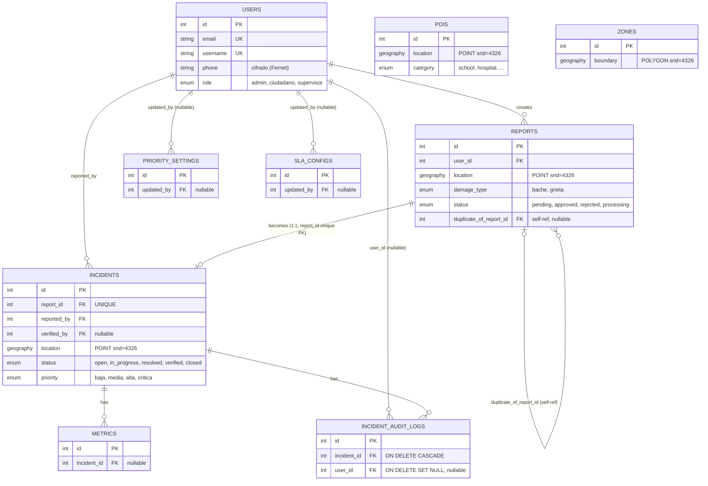

# Esquema de base de datos

[← Volver al índice](../README.md)

Detalle campo por campo de cada tabla en [../backend/DATA_MODELS.md](../backend/DATA_MODELS.md). Este documento se enfoca en las relaciones entre tablas.

## Diagrama de relaciones

**Nota**: `POIS` y `ZONES` no tienen relaciones de clave foránea declaradas hacia otras tablas — se consultan por proximidad/contención geográfica (funciones espaciales de PostGIS) contra `REPORTS`/`INCIDENTS`, no por JOIN relacional directo. No se representan como conectadas en el diagrama porque el vínculo real es espacial (`ST_DWithin`/similar), no una FK.

## Tablas

| Tabla | Modelo | Propósito |
|---|---|---|
| `users` | `User` | Cuentas de usuario (ciudadanos, supervisores, administradores) |
| `reports` | `Report` | Reportes ciudadanos crudos (foto + ubicación + clasificación ML) |
| `incidents` | `Incident` | Reportes aprobados convertidos en incidentes gestionables |
| `incident_audit_logs` | `IncidentAuditLog` | Bitácora de cambios de cada incidente |
| `metrics` | `Metric` | Métricas asociadas a un incidente (tipo/valor/unidad genéricos) |
| `pois` | `POI` | Puntos de interés sensibles usados en el cálculo de prioridad |
| `zones` | `Zone` | Zonas administrativas (polígonos) usadas para filtrado |
| `priority_settings` | `PrioritySetting` | Configuración global (singleton) de pesos de priorización |
| `sla_configs` | `SLAConfig` | Configuración global (singleton) de umbrales de SLA por prioridad |

## Índices relevantes

La mayoría de columnas usadas para filtrado frecuente están indexadas explícitamente: `reports.status`, `reports.created_at`, `reports.duplicate_of_report_id`; `incidents.damage_type`, `.severity`, `.priority`, `.status`, `.sla_deadline`, `.created_at`; `incident_audit_logs.incident_id`, `.event_type`, `.created_at`; `metrics.incident_id`, `.metric_type`, `.category`. Ver el detalle exacto por columna en [../backend/DATA_MODELS.md](../backend/DATA_MODELS.md).

Los campos `Geography` (`location`, `boundary`) usan el índice espacial GiST estándar de PostGIS — no se verificó explícitamente en el código de migración si está creado automáticamente por GeoAlchemy2 o si requiere un `CREATE INDEX` manual; confirmar en la migración `001_initial_schema_with_postgis.py` antes de asumir que las consultas espaciales están optimizadas en un volumen grande de datos.

## Datos sensibles

`users.phone` se cifra en reposo. Ver [../SECURITY.md](../SECURITY.md).
